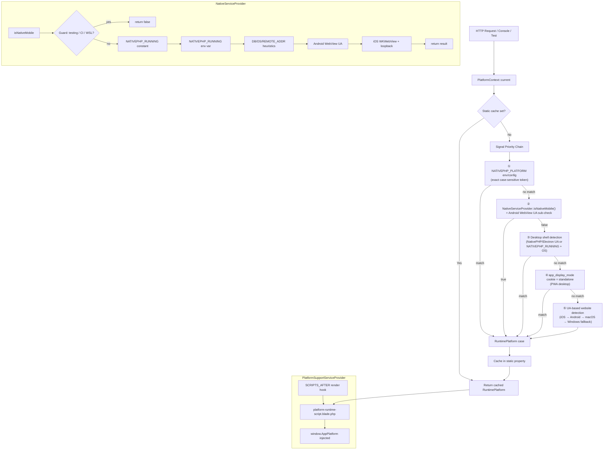
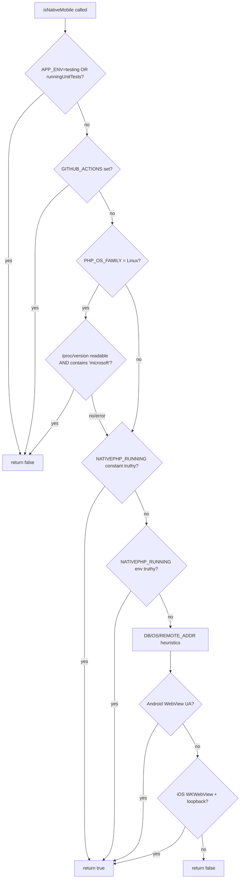

# Design Document: Cross-Platform Detection

## Overview

The cross-platform detection system provides a single authoritative source of truth for which of eight runtime environments the Laravel 12 + Filament v3 + NativePHP wedding organizer application is currently executing in. It resolves a `RuntimePlatform` enum value on every request (HTTP, Artisan console, or PHPUnit) and exposes that value to both PHP and JavaScript without false positives on developer machines, WSL, or CI pipelines.

The system is composed of four collaborating components:

- **`RuntimePlatform` enum** — pure value object with eight cases and derived boolean/string methods
- **`PlatformContext`** — static resolver that evaluates a priority-ordered chain of detection signals and caches the result per request
- **`NativeServiceProvider`** — bootstraps NativePHP configuration and provides low-level mobile detection helpers
- **`PlatformRuntimeScript` Blade component** — injects `window.AppPlatform` into every Filament page using the server-resolved platform value

### Design Goals

1. **Correctness** — every execution context returns exactly one of the eight `RuntimePlatform` cases, never `null`, never an exception
2. **No false positives** — developer machines (Windows, WSL, macOS), CI pipelines, and Artisan console must not be misidentified as mobile or desktop native apps
3. **Single source of truth** — PHP and JavaScript always agree on the platform for the same request
4. **Test isolation** — static caches are resettable so unit tests are independent

---

## Architecture

The detection flow is strictly one-directional: signals flow in, one `RuntimePlatform` value flows out. No component writes back to the signal sources.



### Console Context

When `PlatformContext::current()` is called with no `Request` object (Artisan console), the resolver skips all HTTP-only signals (User-Agent, cookies, `REMOTE_ADDR`) and evaluates only env vars, PHP constants, and `PHP_OS_FAMILY`. The safe fallback is `RuntimePlatform::WebsiteWindows`.

---

## Components and Interfaces

### `App\Enums\RuntimePlatform` (no changes required)

A PHP backed string enum with eight cases. Acts as a pure value object — no application-layer dependencies.

```php
enum RuntimePlatform: string
{
    case WebsiteWindows    = 'website_windows';
    case WebsiteMacOS      = 'website_macos';
    case WebsiteAndroid    = 'website_android';
    case WebsiteIos        = 'website_ios';
    case DesktopAppWindows = 'desktop_app_windows';
    case DesktopAppMacOS   = 'desktop_app_macos';
    case MobileAppAndroid  = 'mobile_app_android';
    case MobileAppIos      = 'mobile_app_ios';

    public function label(): string { ... }
    public function isWebsite(): bool { ... }
    public function isDesktopApp(): bool { ... }
    public function isMobileApp(): bool { ... }
    public function isMobileShell(): bool { ... }  // true for all four mobile cases
    public function cbirCameraMode(): string { ... } // 'native'|'mobile_browser_capture'|'webrtc'
}
```

### `App\Support\PlatformContext` (fix required)

Static resolver. Public interface:

| Method | Signature | Description |
|--------|-----------|-------------|
| `current` | `static current(?Request $request = null): RuntimePlatform` | Resolve and cache the current platform |
| `reset` | `static reset(): void` | Clear static cache (test isolation) |
| `isAnyMobile` | `static isAnyMobile(?Request $request = null): bool` | Delegates to `current()->isMobileShell()` |
| `isNativeMobile` | `static isNativeMobile(?Request $request = null): bool` | Delegates to `current()->isMobileApp()` |
| `cbirCameraMode` | `static cbirCameraMode(?Request $request = null): string` | Delegates to `current()->cbirCameraMode()` |

**Required fix — `nativePlatformFlag()`**: Remove `strtolower()` so the returned value is the raw string for exact case-sensitive comparison.

```php
// BEFORE (incorrect):
return is_string($platform) && $platform !== '' ? strtolower($platform) : null;

// AFTER (correct):
return is_string($platform) && $platform !== '' ? $platform : null;
```

**Required fix — console context guard**: When `$request` is null and `app()->runningInConsole()` is true, skip UA/cookie reads entirely.

### `App\Providers\NativeServiceProvider` (fix required)

Provides `isNativeMobile()`, `isAnyMobile()`, `mobileHostIp()`, `normalizeUrl()`.

**Required fix — WSL `/proc/version` safety**: Wrap the file read in a `try/catch` so that environments where `/proc/version` is unreadable (permissions, non-Linux containers) do not crash the guard:

```php
// BEFORE (unsafe):
if (PHP_OS_FAMILY === 'Linux' && str_contains((string) file_get_contents('/proc/version'), 'microsoft')) {

// AFTER (safe):
if (PHP_OS_FAMILY === 'Linux') {
    try {
        $procVersion = @file_get_contents('/proc/version');
        if ($procVersion !== false && str_contains(strtolower($procVersion), 'microsoft')) {
            return $result = false;
        }
    } catch (\Throwable) {
        // Inconclusive — continue to next detection step
    }
}
```

The same fix applies to the duplicate `/proc/version` read in step 3b of `isNativeMobile()`.

**Required addition — static cache reset**: Add a `resetCache()` method (or expose the static `$result` reset) so tests can clear the cached result between test cases:

```php
public static function resetCache(): void
{
    // Uses a Closure binding trick or a dedicated reset flag
    // to set the static $result back to null
}
```

Since PHP static variables inside methods cannot be reset from outside, the implementation must use a class-level static property instead of a function-level `static $result`:

```php
private static ?bool $isNativeMobileResult = null;

public static function isNativeMobile(): bool
{
    if (self::$isNativeMobileResult !== null) {
        return self::$isNativeMobileResult;
    }
    // ... detection logic ...
}

public static function resetCache(): void
{
    self::$isNativeMobileResult = null;
}
```

### `App\Providers\PlatformSupportServiceProvider` (fix required)

Must pass the server-resolved `RuntimePlatform` to the Blade view so the template does not re-detect independently:

```php
FilamentView::registerRenderHook(
    PanelsRenderHook::SCRIPTS_AFTER,
    fn (): View => view('filament.components.platform-runtime-script', [
        'platform' => \App\Support\PlatformContext::current(request()),
    ]),
);
```

### `resources/views/filament/components/platform-runtime-script.blade.php` (fix required)

Must inject `window.AppPlatform` using the server-resolved `$platform` variable passed from the service provider, and wrap all JavaScript in a `try/catch`:

```html
<script>
try {
    window.AppPlatform = {
        slug:          @json($platform->value),
        label:         @json($platform->label()),
        isWebsite:     {{ $platform->isWebsite()    ? 'true' : 'false' }},
        isDesktopApp:  {{ $platform->isDesktopApp() ? 'true' : 'false' }},
        isMobileApp:   {{ $platform->isMobileApp()  ? 'true' : 'false' }},
        isMobileShell: {{ $platform->isMobileShell()? 'true' : 'false' }},
        cbirCameraMode: @json(in_array($platform->cbirCameraMode(), ['native','mobile_browser_capture','webrtc'])
                              ? $platform->cbirCameraMode()
                              : 'webrtc'),
    };

    // PWA standalone cookie detection
    var standalone = window.matchMedia('(display-mode: standalone)').matches
        || window.navigator.standalone === true;

    if (standalone && document.cookie.indexOf('app_display_mode=standalone') === -1) {
        document.cookie = 'app_display_mode=standalone;path=/;max-age=31536000;SameSite=Lax';
    }
} catch (e) {
    console.error('[AppPlatform] Runtime script error:', e);
}
</script>
```

---

## Data Models

### Detection Signal Priority Table

| Priority | Signal | Source | Recognised Values |
|----------|--------|--------|-------------------|
| 1 | `NATIVEPHP_PLATFORM` | `env()` / `$_SERVER` / `config('nativephp-internal.platform')` | `android`, `ios`, `win32`, `windows`, `mac`, `macos`, `darwin` (exact case) |
| 2 | `NativeServiceProvider::isNativeMobile()` | PHP constant `NATIVEPHP_RUNNING`, env var, OS/UA heuristics | boolean |
| 3 | Desktop shell UA | `HTTP_USER_AGENT` | `NativePHP` (no Mobile suffix), `Electron/` |
| 4 | `app_display_mode` cookie | HTTP cookie | `standalone` |
| 5 | UA-based website | `HTTP_USER_AGENT` | `iPhone`/`iPad`/`iPod`, `Android`, `Macintosh`/`Mac OS X`, fallback |

### Platform Token → RuntimePlatform Mapping

| `NATIVEPHP_PLATFORM` token | `RuntimePlatform` case |
|---------------------------|------------------------|
| `android` | `MobileAppAndroid` |
| `ios` | `MobileAppIos` |
| `win32` | `DesktopAppWindows` |
| `windows` | `DesktopAppWindows` |
| `mac` | `DesktopAppMacOS` |
| `macos` | `DesktopAppMacOS` |
| `darwin` | `DesktopAppMacOS` |

### `window.AppPlatform` JavaScript Object Shape

```typescript
interface AppPlatform {
    slug:           string;   // RuntimePlatform->value, e.g. "mobile_app_android"
    label:          string;   // Human-readable, e.g. "Mobile App (Android)"
    isWebsite:      boolean;
    isDesktopApp:   boolean;
    isMobileApp:    boolean;
    isMobileShell:  boolean;  // true for all four mobile cases
    cbirCameraMode: 'native' | 'mobile_browser_capture' | 'webrtc';
}
```

### `isNativeMobile()` Guard Chain



---

## Correctness Properties

*A property is a characteristic or behavior that should hold true across all valid executions of a system — essentially, a formal statement about what the system should do. Properties serve as the bridge between human-readable specifications and machine-verifiable correctness guarantees.*

### Property 1: `current()` always returns a valid RuntimePlatform

*For any* combination of User-Agent string, env vars (`NATIVEPHP_PLATFORM`, `NATIVEPHP_RUNNING`), cookie values, and OS family, `PlatformContext::current()` SHALL return exactly one of the eight `RuntimePlatform` cases and SHALL never return `null` or throw an exception.

**Validates: Requirements 1.1**

---

### Property 2: Detection is idempotent within a request

*For any* initial call to `PlatformContext::current()` that returns a value, all subsequent calls within the same PHP process (without calling `reset()`) SHALL return the identical `RuntimePlatform` value regardless of any signal changes that occur after the first call.

**Validates: Requirements 1.2**

---

### Property 3: `reset()` enables re-detection with new signals

*For any* pair of distinct detection signal configurations A and B, calling `current()` with configuration A, then calling `reset()`, then calling `current()` with configuration B SHALL return the platform corresponding to configuration B, not configuration A.

**Validates: Requirements 1.3, 5.4**

---

### Property 4: Case-sensitive token matching — wrong-case tokens are ignored

*For any* wrong-case variant of a recognised platform token (e.g. `Android`, `IOS`, `WIN32`, `Mac`, `Darwin`), setting `NATIVEPHP_PLATFORM` to that variant SHALL cause `PlatformContext::current()` to ignore the signal and fall through to the next detection step, producing the same result as if `NATIVEPHP_PLATFORM` were unset.

**Validates: Requirements 1.6**

---

### Property 5: Testing guard overrides all other signals in `isNativeMobile()`

*For any* combination of env vars, PHP constants, OS family, and UA strings, if `APP_ENV` equals `testing` or `app()->runningUnitTests()` returns `true`, then `NativeServiceProvider::isNativeMobile()` SHALL return `false`.

**Validates: Requirements 2.7, 5.1**

---

### Property 6: Android WebView UA always resolves to MobileAppAndroid

*For any* User-Agent string matching the pattern `/Android.*wv\)/i` when `NATIVEPHP_PLATFORM` is not set, `PlatformContext::current()` SHALL return `RuntimePlatform::MobileAppAndroid`.

**Validates: Requirements 2.5**

---

### Property 7: Mobile takes precedence over desktop signals

*For any* combination of signals where `NativeServiceProvider::isNativeMobile()` returns `true` alongside desktop signals (Electron UA, `NATIVEPHP_RUNNING` + Windows OS, `app_display_mode=standalone`), `PlatformContext::current()` SHALL return a mobile platform case (`MobileAppAndroid` or `MobileAppIos`), never a desktop platform case.

**Validates: Requirements 3.4**

---

### Property 8: iOS UA takes priority over macOS UA

*For any* User-Agent string containing `iPhone`, `iPad`, or `iPod` (including iPadOS desktop-mode UAs that also contain `Macintosh`), when `NativeServiceProvider::isNativeMobile()` returns `false`, `PlatformContext::current()` SHALL return `RuntimePlatform::WebsiteIos` and SHALL NOT return `RuntimePlatform::WebsiteMacOS`.

**Validates: Requirements 4.1**

---

### Property 9: `isAnyMobile()` correctly classifies all eight cases

*For any* of the eight `RuntimePlatform` cases, `PlatformContext::isAnyMobile()` SHALL return `true` if and only if the case is one of `WebsiteAndroid`, `WebsiteIos`, `MobileAppAndroid`, or `MobileAppIos`, and SHALL return `false` for `WebsiteWindows`, `WebsiteMacOS`, `DesktopAppWindows`, and `DesktopAppMacOS`.

**Validates: Requirements 4.5**

---

### Property 10: `window.AppPlatform` reflects the server-resolved platform for all cases

*For any* of the eight `RuntimePlatform` cases passed to the `platform-runtime-script` Blade component, the rendered `<script>` tag SHALL contain a `window.AppPlatform` object whose `slug`, `label`, `isWebsite`, `isDesktopApp`, `isMobileApp`, `isMobileShell`, and `cbirCameraMode` properties exactly match the corresponding `RuntimePlatform` method results for that case.

**Validates: Requirements 6.2, 6.3, 6.4, 6.5, 8.1**

---

### Property 11: `RuntimePlatform` enum round-trip

*For any* of the eight `RuntimePlatform` cases, `RuntimePlatform::from($case->value)` SHALL return the original case, and no two cases SHALL share the same `->value` string.

**Validates: Requirements 8.3, 8.4**

---

## Error Handling

### `PlatformContext::current()` — never throws

The method is wrapped in a defensive fallback: if any detection step throws an unexpected exception (e.g. a misconfigured `config()` call), the exception is caught and `RuntimePlatform::WebsiteWindows` is returned as the safe default. This ensures Filament pages always render even if detection fails.

### `NativeServiceProvider::isNativeMobile()` — `/proc/version` safety

The `/proc/version` file read is wrapped in `try/catch(\Throwable)`. If the read fails (file not found, permission denied, non-Linux container), the WSL check is treated as inconclusive and detection continues to the next step. This prevents a crash on Linux environments that do not expose `/proc/version`.

### `platform-runtime-script.blade.php` — JavaScript `try/catch`

All JavaScript in the script tag is wrapped in a `try { ... } catch (e) { console.error(...) }` block. If `window.AppPlatform` assignment fails for any reason (e.g. a browser extension blocking globals), the error is logged to the console but does not prevent the rest of the page from loading.

### `cbirCameraMode` fallback

If `RuntimePlatform::cbirCameraMode()` returns an unrecognised value (defensive against future enum changes), the Blade template defaults to `'webrtc'` using an `in_array` guard before injecting the value into JavaScript.

---

## Testing Strategy

### Framework

PestPHP v4 with `pestphp/pest-plugin-laravel`. Tests live in `tests/Unit/`.

### Dual Testing Approach

- **Unit/example tests** — verify specific scenarios, guard conditions, and edge cases with concrete inputs
- **Property-based tests** — verify universal properties across many generated inputs using PestPHP's `dataset()` with exhaustive case enumeration or randomised input generation

PestPHP v4 does not bundle a property-based testing library. The property tests for this feature use **exhaustive enumeration** (all 8 `RuntimePlatform` cases) and **parameterised datasets** (representative UA strings, token variants) rather than a random generator, which is appropriate given the finite, well-defined input space.

### Test Files

#### `tests/Unit/PlatformContextTest.php`

Covers `PlatformContext` detection logic:

- **Property 1** — dataset of UA/env combinations, assert result is always a valid `RuntimePlatform` case
- **Property 2** — call `current()` twice without `reset()`, assert identical results
- **Property 3** — call `current()` with signal A, `reset()`, call with signal B, assert B's result
- **Property 4** — dataset of wrong-case tokens (`Android`, `IOS`, `WIN32`, `Mac`, `Darwin`), assert each is ignored
- **Property 6** — dataset of Android WebView UA strings, assert `MobileAppAndroid`
- **Property 7** — dataset of mobile + desktop signal combinations, assert mobile wins
- **Property 8** — dataset of iOS UAs including iPadOS desktop-mode, assert `WebsiteIos`
- **Property 9** — all 8 `RuntimePlatform` cases, assert `isAnyMobile()` returns correct boolean
- **Property 10** — all 8 `RuntimePlatform` cases rendered through Blade, assert `window.AppPlatform` properties
- **Property 11** — all 8 `RuntimePlatform` cases, assert `from(value)` round-trip and unique values
- Example tests for console context (no request, no exception, `WebsiteWindows` fallback)
- Example tests for each `NATIVEPHP_PLATFORM` token → expected `RuntimePlatform` case

#### `tests/Unit/NativeServiceProviderTest.php`

Covers `NativeServiceProvider::isNativeMobile()` guards:

- **Property 5** — dataset of signal combinations with `APP_ENV=testing`, assert always `false`
- Example: `GITHUB_ACTIONS` set → `false`
- Example: `/proc/version` contains `microsoft` → `false`
- Example: `/proc/version` read fails → detection continues (no exception)
- Example: `NATIVEPHP_RUNNING` constant defined and truthy → `true`
- Example: `NATIVEPHP_RUNNING` env var truthy → `true`
- Cache reset between tests via `NativeServiceProvider::resetCache()`

### Test Isolation

Each test calls `PlatformContext::reset()` and `NativeServiceProvider::resetCache()` in a `beforeEach` hook to clear static caches. This ensures tests are independent regardless of execution order.

### Tag Format

Each property-based test is tagged with a comment referencing the design property:

```php
// Feature: cross-platform-detection, Property 1: current() always returns a valid RuntimePlatform
```

### What Is Not Tested Here

- **JavaScript cookie behavior** (Requirements 6.6, 6.7) — client-side JS; covered by E2E/browser tests
- **Filament render hook registration** (Requirement 8.2) — integration test; verified by booting the application
- **Import correctness** (Requirement 7) — smoke test; verified by PHP's class resolution at runtime
