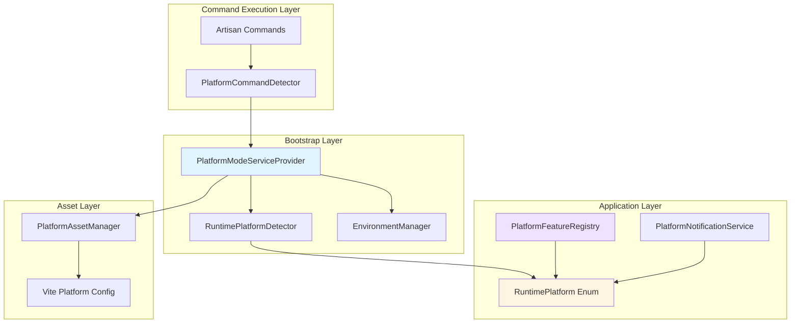
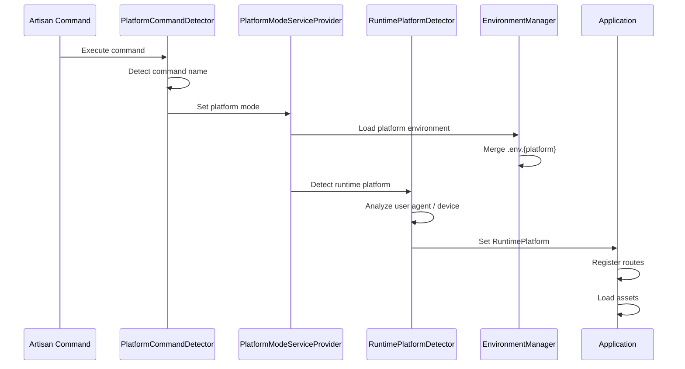

# Design Document: Multi-Platform Command Support

## Overview

The multi-platform command support feature enables the Laravel Wedding Organizer CBIR application to operate correctly across three distinct runtime environments: web browsers, native mobile apps, and desktop applications. Each environment is initiated through a specific Artisan command and requires unique platform detection, asset compilation, environment configuration, and feature availability management.

This design introduces a layered architecture that:
- **Command Layer**: Intercepts Artisan command execution to determine platform mode
- **Detection Layer**: Identifies the specific runtime platform within each mode
- **Configuration Layer**: Manages environment-specific settings and variables
- **Asset Layer**: Compiles and serves platform-appropriate resources
- **Feature Layer**: Tracks and validates feature availability per platform

The system integrates seamlessly with the existing `RuntimePlatform` enum and `PlatformNotificationService`, extending their capabilities while maintaining backward compatibility.

### Platform Modes and Commands

| Command | Platform Mode | Target Environment | RuntimePlatform Cases |
|---------|--------------|-------------------|---------------------|
| `php artisan serve` | Web Server Mode | Web browsers | WebsiteWindows, WebsiteMacOS, WebsiteAndroid, WebsiteIos |
| `php artisan native:run` | Mobile Native Mode | Android/iOS apps | MobileAppAndroid, MobileAppIos |
| `php artisan native:serve` | Desktop App Mode | Windows/Mac apps | DesktopAppWindows, DesktopAppMacOS |

## Architecture

### Component Overview



### Data Flow



## Components and Interfaces

### 1. PlatformCommandDetector

**Responsibility**: Detect which Artisan command is executing and determine the appropriate platform mode.

**Location**: `app/Support/Platform/PlatformCommandDetector.php`

```php
namespace App\Support\Platform;

class PlatformCommandDetector
{
    public static function detectMode(): PlatformMode
    {
        $argv = $_SERVER['argv'] ?? [];
        
        if (self::isRunningArtisan($argv)) {
            return self::detectFromCommand($argv);
        }
        
        return self::detectFromRuntime();
    }
    
    private static function isRunningArtisan(array $argv): bool
    {
        return isset($argv[0]) && str_ends_with($argv[0], 'artisan');
    }
    
    private static function detectFromCommand(array $argv): PlatformMode
    {
        $command = $argv[1] ?? null;
        
        return match(true) {
            $command === 'serve' => PlatformMode::Web,
            $command === 'native:run' => PlatformMode::Mobile,
            $command === 'native:serve' => PlatformMode::Desktop,
            str_starts_with($command ?? '', 'native:') => PlatformMode::Desktop,
            default => PlatformMode::Web
        };
    }
    
    private static function detectFromRuntime(): PlatformMode
    {
        // Detection when running via HTTP server or native runtime
        if (class_exists(\Native\Laravel\Facades\Window::class)) {
            return PlatformMode::Desktop;
        }
        
        if (class_exists(\Native\Mobile\Dialog::class)) {
            return PlatformMode::Mobile;
        }
        
        return PlatformMode::Web;
    }
}
```

### 2. PlatformMode Enum

**Responsibility**: Define the three platform modes with helper methods.

**Location**: `app/Enums/PlatformMode.php`

```php
namespace App\Enums;

enum PlatformMode: string
{
    case Web = 'web';
    case Mobile = 'mobile';
    case Desktop = 'desktop';
    
    public function label(): string
    {
        return match($this) {
            self::Web => 'Web Server',
            self::Mobile => 'Mobile Native',
            self::Desktop => 'Desktop Application',
        };
    }
    
    public function environmentFile(): string
    {
        return ".env.{$this->value}";
    }
    
    public function assetDirectory(): string
    {
        return "build/{$this->value}";
    }
    
    public function viteInput(): string
    {
        return "resources/js/app-{$this->value}.js";
    }
    
    public function allowsCameraAccess(): bool
    {
        return $this === self::Mobile || $this === self::Desktop;
    }
    
    public function allowsFileSystemAccess(): bool
    {
        return $this === self::Mobile || $this === self::Desktop;
    }
}
```

### 3. RuntimePlatformDetector

**Responsibility**: Detect the specific RuntimePlatform case based on the platform mode and device information.

**Location**: `app/Support/Platform/RuntimePlatformDetector.php`

```php
namespace App\Support\Platform;

use App\Enums\PlatformMode;
use App\Enums\RuntimePlatform;
use Illuminate\Http\Request;
use Illuminate\Support\Facades\Log;

class RuntimePlatformDetector
{
    public function detect(PlatformMode $mode, ?Request $request = null): RuntimePlatform
    {
        try {
            return match($mode) {
                PlatformMode::Web => $this->detectWebPlatform($request),
                PlatformMode::Mobile => $this->detectMobilePlatform(),
                PlatformMode::Desktop => $this->detectDesktopPlatform(),
            };
        } catch (\Throwable $e) {
            Log::warning('Platform detection failed', [
                'mode' => $mode->value,
                'error' => $e->getMessage()
            ]);
            return RuntimePlatform::WebsiteWindows;
        }
    }
    
    private function detectWebPlatform(?Request $request): RuntimePlatform
    {
        if (!$request) {
            return RuntimePlatform::WebsiteWindows;
        }
        
        $userAgent = strtolower($request->userAgent() ?? '');
        
        if (str_contains($userAgent, 'iphone') || str_contains($userAgent, 'ipad')) {
            return RuntimePlatform::WebsiteIos;
        }
        
        if (str_contains($userAgent, 'android')) {
            return RuntimePlatform::WebsiteAndroid;
        }
        
        if (str_contains($userAgent, 'mac') || str_contains($userAgent, 'darwin')) {
            return RuntimePlatform::WebsiteMacOS;
        }
        
        return RuntimePlatform::WebsiteWindows;
    }
    
    private function detectMobilePlatform(): RuntimePlatform
    {
        // Check for NativePHP Mobile APIs
        if (class_exists(\Native\Mobile\Device::class)) {
            $platform = \Native\Mobile\Device::platform();
            return $platform === 'ios' 
                ? RuntimePlatform::MobileAppIos 
                : RuntimePlatform::MobileAppAndroid;
        }
        
        // Fallback detection from environment or config
        $platform = config('native.platform', 'android');
        return $platform === 'ios' 
            ? RuntimePlatform::MobileAppIos 
            : RuntimePlatform::MobileAppAndroid;
    }
    
    private function detectDesktopPlatform(): RuntimePlatform
    {
        // Check PHP_OS constant
        $os = PHP_OS_FAMILY;
        
        if ($os === 'Darwin') {
            return RuntimePlatform::DesktopAppMacOS;
        }
        
        return RuntimePlatform::DesktopAppWindows;
    }
}
```

### 4. PlatformModeServiceProvider

**Responsibility**: Bootstrap platform detection, environment loading, and asset configuration during application initialization.

**Location**: `app/Providers/PlatformModeServiceProvider.php`

```php
namespace App\Providers;

use App\Enums\PlatformMode;
use App\Support\Platform\PlatformCommandDetector;
use App\Support\Platform\RuntimePlatformDetector;
use App\Support\Platform\EnvironmentManager;
use App\Support\Platform\PlatformAssetManager;
use Illuminate\Support\ServiceProvider;

class PlatformModeServiceProvider extends ServiceProvider
{
    public function register(): void
    {
        // Detect platform mode early
        $mode = PlatformCommandDetector::detectMode();
        
        $this->app->singleton('platform.mode', fn() => $mode);
        
        // Register platform-aware services
        $this->app->singleton(RuntimePlatformDetector::class);
        $this->app->singleton(EnvironmentManager::class);
        $this->app->singleton(PlatformAssetManager::class);
    }
    
    public function boot(): void
    {
        $mode = $this->app->make('platform.mode');
        
        // Load platform-specific environment
        $envManager = $this->app->make(EnvironmentManager::class);
        $envManager->loadPlatformEnvironment($mode);
        
        // Detect runtime platform
        $detector = $this->app->make(RuntimePlatformDetector::class);
        $request = $this->app['request'] ?? null;
        $runtimePlatform = $detector->detect($mode, $request);
        
        // Store runtime platform globally
        $this->app->singleton('runtime.platform', fn() => $runtimePlatform);
        
        // Configure asset manager
        $assetManager = $this->app->make(PlatformAssetManager::class);
        $assetManager->configure($mode);
        
        // Log platform detection in development
        if ($this->app->environment('local')) {
            \Illuminate\Support\Facades\Log::info('Platform detected', [
                'mode' => $mode->value,
                'runtime' => $runtimePlatform->value,
            ]);
        }
    }
}
```

### 5. EnvironmentManager

**Responsibility**: Load and merge platform-specific environment files.

**Location**: `app/Support/Platform/EnvironmentManager.php`

```php
namespace App\Support\Platform;

use App\Enums\PlatformMode;
use Illuminate\Support\Facades\Log;

class EnvironmentManager
{
    public function loadPlatformEnvironment(PlatformMode $mode): void
    {
        $platformEnvFile = base_path($mode->environmentFile());
        
        if (!file_exists($platformEnvFile)) {
            return;
        }
        
        $platformVars = $this->parseEnvironmentFile($platformEnvFile);
        
        foreach ($platformVars as $key => $value) {
            $_ENV[$key] = $value;
            $_SERVER[$key] = $value;
            putenv("{$key}={$value}");
        }
        
        Log::info("Loaded platform environment", [
            'file' => $mode->environmentFile(),
            'vars_count' => count($platformVars)
        ]);
    }
    
    private function parseEnvironmentFile(string $path): array
    {
        $lines = file($path, FILE_IGNORE_NEW_LINES | FILE_SKIP_EMPTY_LINES);
        $vars = [];
        
        foreach ($lines as $line) {
            // Skip comments
            if (str_starts_with(trim($line), '#')) {
                continue;
            }
            
            // Parse KEY=VALUE
            if (str_contains($line, '=')) {
                [$key, $value] = explode('=', $line, 2);
                $key = trim($key);
                $value = trim($value);
                
                // Remove quotes
                $value = trim($value, '"\'');
                
                $vars[$key] = $value;
            }
        }
        
        return $vars;
    }
}
```

### 6. PlatformAssetManager

**Responsibility**: Configure and serve platform-specific compiled assets.

**Location**: `app/Support/Platform/PlatformAssetManager.php`

```php
namespace App\Support\Platform;

use App\Enums\PlatformMode;

class PlatformAssetManager
{
    private ?PlatformMode $mode = null;
    
    public function configure(PlatformMode $mode): void
    {
        $this->mode = $mode;
    }
    
    public function getManifestPath(): string
    {
        $buildDir = $this->mode?->assetDirectory() ?? 'build/web';
        return public_path("{$buildDir}/manifest.json");
    }
    
    public function getBuildDirectory(): string
    {
        return $this->mode?->assetDirectory() ?? 'build/web';
    }
    
    public function getViteInput(): string
    {
        return $this->mode?->viteInput() ?? 'resources/js/app-web.js';
    }
    
    public function asset(string $path): string
    {
        $manifest = $this->loadManifest();
        
        if (isset($manifest[$path])) {
            $buildDir = $this->getBuildDirectory();
            return asset("{$buildDir}/{$manifest[$path]['file']}");
        }
        
        return asset($path);
    }
    
    private function loadManifest(): array
    {
        $manifestPath = $this->getManifestPath();
        
        if (!file_exists($manifestPath)) {
            return [];
        }
        
        return json_decode(file_get_contents($manifestPath), true) ?? [];
    }
}
```

### 7. PlatformFeatureRegistry

**Responsibility**: Track and validate feature availability for each runtime platform.

**Location**: `app/Support/Platform/PlatformFeatureRegistry.php`

```php
namespace App\Support\Platform;

use App\Enums\RuntimePlatform;

class PlatformFeatureRegistry
{
    private const FEATURE_MATRIX = [
        'camera' => [
            RuntimePlatform::MobileAppAndroid,
            RuntimePlatform::MobileAppIos,
            RuntimePlatform::DesktopAppWindows,
            RuntimePlatform::DesktopAppMacOS,
        ],
        'desktop_notifications' => [
            RuntimePlatform::DesktopAppWindows,
            RuntimePlatform::DesktopAppMacOS,
        ],
        'push_notifications' => [
            RuntimePlatform::MobileAppAndroid,
            RuntimePlatform::MobileAppIos,
        ],
        'file_system' => [
            RuntimePlatform::MobileAppAndroid,
            RuntimePlatform::MobileAppIos,
            RuntimePlatform::DesktopAppWindows,
            RuntimePlatform::DesktopAppMacOS,
        ],
        'webrtc' => [
            RuntimePlatform::WebsiteWindows,
            RuntimePlatform::WebsiteMacOS,
            RuntimePlatform::WebsiteAndroid,
            RuntimePlatform::WebsiteIos,
        ],
        'auto_updates' => [
            RuntimePlatform::DesktopAppWindows,
            RuntimePlatform::DesktopAppMacOS,
        ],
        'app_badge' => [
            RuntimePlatform::MobileAppAndroid,
            RuntimePlatform::MobileAppIos,
        ],
    ];
    
    public function isAvailable(string $feature, RuntimePlatform $platform): bool
    {
        if (!isset(self::FEATURE_MATRIX[$feature])) {
            return false;
        }
        
        return in_array($platform, self::FEATURE_MATRIX[$feature], true);
    }
    
    public function getAvailableFeatures(RuntimePlatform $platform): array
    {
        $features = [];
        
        foreach (self::FEATURE_MATRIX as $feature => $platforms) {
            if (in_array($platform, $platforms, true)) {
                $features[] = $feature;
            }
        }
        
        return $features;
    }
    
    public function getPlatformsForFeature(string $feature): array
    {
        return self::FEATURE_MATRIX[$feature] ?? [];
    }
}
```

### 8. Helper Functions

**Responsibility**: Provide convenient access to platform information throughout the application.

**Location**: `app/helpers.php`

```php
use App\Enums\PlatformMode;
use App\Enums\RuntimePlatform;
use App\Support\Platform\PlatformFeatureRegistry;

if (!function_exists('platform_mode')) {
    function platform_mode(): PlatformMode
    {
        return app('platform.mode');
    }
}

if (!function_exists('runtime_platform')) {
    function runtime_platform(): RuntimePlatform
    {
        return app('runtime.platform');
    }
}

if (!function_exists('platform_feature')) {
    function platform_feature(string $feature): bool
    {
        $registry = app(PlatformFeatureRegistry::class);
        return $registry->isAvailable($feature, runtime_platform());
    }
}

if (!function_exists('is_web_mode')) {
    function is_web_mode(): bool
    {
        return platform_mode() === PlatformMode::Web;
    }
}

if (!function_exists('is_mobile_mode')) {
    function is_mobile_mode(): bool
    {
        return platform_mode() === PlatformMode::Mobile;
    }
}

if (!function_exists('is_desktop_mode')) {
    function is_desktop_mode(): bool
    {
        return platform_mode() === PlatformMode::Desktop;
    }
}
```

### 9. Conditional Route Registration

**Responsibility**: Register routes conditionally based on platform mode.

**Location**: `routes/web.php`, `routes/mobile.php`, `routes/desktop.php`

**Example Usage**:

```php
// routes/web.php - Only loaded in Web mode
Route::middleware(['web'])->group(function () {
    Route::get('/browser-only-feature', function () {
        return view('web.feature');
    });
});

// routes/mobile.php - Only loaded in Mobile mode
Route::middleware(['api'])->prefix('api/mobile')->group(function () {
    Route::post('/camera/capture', [MobileCameraController::class, 'capture']);
});

// routes/desktop.php - Only loaded in Desktop mode
Route::middleware(['api'])->prefix('api/desktop')->group(function () {
    Route::post('/file/save', [DesktopFileController::class, 'save']);
});
```

**Route Service Provider Update**:

```php
// app/Providers/RouteServiceProvider.php
public function boot(): void
{
    $this->routes(function () {
        Route::middleware('api')
            ->prefix('api')
            ->group(base_path('routes/api.php'));

        Route::middleware('web')
            ->group(base_path('routes/web.php'));
        
        // Platform-specific routes
        $mode = platform_mode();
        
        if ($mode === PlatformMode::Mobile && file_exists(base_path('routes/mobile.php'))) {
            Route::middleware('api')
                ->prefix('api/mobile')
                ->group(base_path('routes/mobile.php'));
        }
        
        if ($mode === PlatformMode::Desktop && file_exists(base_path('routes/desktop.php'))) {
            Route::middleware('api')
                ->prefix('api/desktop')
                ->group(base_path('routes/desktop.php'));
        }
    });
}
```

## Data Models

### Configuration Data

Platform-specific environment files follow standard Laravel `.env` format:

```env
# .env.web
APP_URL=http://localhost:8000
VITE_PLATFORM=web
SESSION_DRIVER=cookie

# .env.mobile
APP_URL=http://10.0.2.2:8000
VITE_PLATFORM=mobile
SESSION_DRIVER=database

# .env.desktop
APP_URL=http://localhost:8000
VITE_PLATFORM=desktop
SESSION_DRIVER=file
```

### Asset Manifest Structure

```json
{
  "resources/js/app-web.js": {
    "file": "assets/app-web.a1b2c3d4.js",
    "src": "resources/js/app-web.js",
    "isEntry": true,
    "css": ["assets/app-web.e5f6g7h8.css"]
  },
  "resources/css/app.css": {
    "file": "assets/app.i9j0k1l2.css",
    "src": "resources/css/app.css"
  }
}
```

### Feature Availability Matrix

| Feature | Web | Mobile | Desktop |
|---------|-----|--------|---------|
| Camera (Native) | ❌ | ✅ | ✅ |
| WebRTC | ✅ | ❌ | ❌ |
| Desktop Notifications | ❌ | ❌ | ✅ |
| Push Notifications | ❌ | ✅ | ❌ |
| File System Access | ❌ | ✅ | ✅ |
| Auto Updates | ❌ | ✅ | ✅ |
| App Badge | ❌ | ✅ | ❌ |

## Correctness Properties

*A property is a characteristic or behavior that should hold true across all valid executions of a system—essentially, a formal statement about what the system should do. Properties serve as the bridge between human-readable specifications and machine-verifiable correctness guarantees.*


## Property Reflection

After reviewing the prework analysis, I identified the following properties that need consolidation:

**Redundancies Identified:**
1. Properties 3.2, 3.3, 3.4 (environment merging for each mode) can be consolidated into a single property about environment merging behavior across all modes
2. Properties 4.2, 4.3, 4.4 (asset compilation to different directories) are examples, not universal properties
3. Properties 5.3, 5.4, 5.5, 5.6, 5.7 (specific feature-platform mappings) are examples of a more general property about feature registry correctness
4. Properties 6.1, 6.2, 6.3 (camera API selection) are examples, not universal properties

**Properties to Keep:**
- Property 1.6: Command sequence handling (platform mode changes with last command)
- Property 2.1: User agent detection (universal behavior for all user agents)
- Property 2.4: Detection result type (always returns valid enum)
- Property 2.6: Exception handling (always defaults to WebsiteWindows)
- Property 3.5: Environment merge precedence (platform values override base)
- Property 4.6: Asset manifest injection (correct manifest for mode)
- Property 5.8: File system availability (matches platform mode)
- Property 6.5: Permission denial messages (shown for all platforms)
- Property 7.5: Missing dependency listing (all missing dependencies listed)
- Property 9.5: Unsupported platform route access (404 for wrong platform)
- Property 9.7: Route caching (only compatible routes cached)
- Property 10.5: User agent detection completeness (all strings return valid enum)
- Property 10.6: Enum method consistency (category methods are mutually exclusive)

### Property 1: Platform Mode Switches with Last Command

*For any* sequence of Artisan commands executed consecutively, the final active platform mode SHALL match the mode associated with the last command in the sequence.

**Validates: Requirements 1.6**

### Property 2: User Agent Detection Completeness

*For any* valid user agent string provided to the Platform Detector in Web Server Mode, the detector SHALL return one of the four website RuntimePlatform enum cases (WebsiteWindows, WebsiteMacOS, WebsiteAndroid, or WebsiteIos).

**Validates: Requirements 2.1, 10.5**

### Property 3: Platform Detection Always Returns Valid Enum

*For any* platform detection inputs (including mode, request, device info), the RuntimePlatformDetector SHALL return a value that is a valid case of the RuntimePlatform enum.

**Validates: Requirements 2.4**

### Property 4: Platform Detection Failure Defaults to WebsiteWindows

*For any* exception or error that occurs during platform detection, the Platform Detector SHALL catch the exception, log a warning, and return RuntimePlatform::WebsiteWindows as the default value.

**Validates: Requirements 2.6**

### Property 5: Environment Variable Merge Precedence

*For any* environment variable key that exists in both the base `.env` file and a platform-specific `.env.{mode}` file, the Environment Manager SHALL use the value from the platform-specific file when that platform mode is active.

**Validates: Requirements 3.5**

### Property 6: Asset Manifest Path Matches Platform Mode

*For any* platform mode (Web, Mobile, Desktop), when the Asset Manager is configured for that mode, the manifest path returned SHALL contain the directory name matching that mode's asset directory (build/web, build/mobile, or build/desktop).

**Validates: Requirements 4.6**

### Property 7: File System Availability Matches Platform Mode

*For all* RuntimePlatform enum cases, file system access feature availability SHALL return true if and only if the platform is in Mobile Native Mode or Desktop App Mode (MobileAppAndroid, MobileAppIos, DesktopAppWindows, DesktopAppMacOS).

**Validates: Requirements 5.8**

### Property 8: Permission Denial Messages Are Platform-Aware

*For any* RuntimePlatform case, when camera access permission is denied, the Application SHALL display a non-empty error message appropriate for that platform's permission model.

**Validates: Requirements 6.5**

### Property 9: Missing Dependencies Are Fully Listed

*For any* set of missing platform dependencies detected during command execution, the error message SHALL include references to all packages in that set, with no omissions.

**Validates: Requirements 7.5**

### Property 10: Unsupported Platform Routes Return 404

*For any* route registered as platform-specific, when accessed from a RuntimePlatform that is not in the route's supported platform list, the Application SHALL return an HTTP 404 response.

**Validates: Requirements 9.5**

### Property 11: Route Cache Contains Only Compatible Routes

*For any* platform mode (Web, Mobile, Desktop), the cached route collection for that mode SHALL contain only routes that are marked as compatible with that mode or are mode-agnostic.

**Validates: Requirements 9.7**

### Property 12: RuntimePlatform Category Methods Are Mutually Exclusive

*For all* RuntimePlatform enum cases, exactly one of the three category methods (isWebsite(), isDesktopApp(), isMobileApp()) SHALL return true, and the other two SHALL return false.

**Validates: Requirements 10.6**

## Error Handling

### Error Scenarios and Responses

| Scenario | Detection | Response | Recovery |
|----------|-----------|----------|----------|
| Missing NativePHP dependencies | Command validator checks for class existence | Display error with package names and installation instructions | Exit with code 1 |
| Platform-specific .env file not found | File existence check | Log info message, continue with base .env | Use base environment |
| Invalid user agent string | Exception during parsing | Log warning, default to WebsiteWindows | Continue with default |
| Asset manifest missing | File existence check | Return original asset paths | Serve unversioned assets |
| Route accessed from wrong platform | Middleware check | Return 404 response | N/A (expected behavior) |
| Feature not available on platform | Feature registry check | Return false from availability check | Caller handles gracefully |
| Environment variable conflict | Key collision during merge | Platform-specific value takes precedence | Continue with platform value |
| Port already in use | Server startup failure | Display error with used port | User must choose different port |

### Error Messages

**Missing Dependencies**:
```
Error: Required dependencies for {mode} mode are not installed.

Missing packages:
  - {package1}
  - {package2}

To install, run:
  composer require {package1} {package2}
```

**Unsupported Platform Route**:
```
404 Not Found
This endpoint is only available on {supported_platforms}.
Current platform: {current_platform}
```

**Permission Denial**:
```
Web: "Camera access denied. Please allow camera access in your browser settings."
Mobile: "Camera permission required. Please enable camera access in Settings > Privacy."
Desktop: "Camera access denied. Please grant camera permission to this application."
```

### Logging Strategy

```php
// Platform detection
Log::info('Platform detected', [
    'mode' => $mode->value,
    'runtime' => $runtimePlatform->value,
    'detection_time_ms' => $detectionTime
]);

// Environment loading
Log::info('Platform environment loaded', [
    'file' => $envFile,
    'vars_loaded' => count($vars),
    'conflicts_resolved' => count($conflicts)
]);

// Platform detection failure
Log::warning('Platform detection failed, using default', [
    'error' => $e->getMessage(),
    'default' => RuntimePlatform::WebsiteWindows->value
]);

// Missing dependencies
Log::error('Platform dependencies missing', [
    'mode' => $mode->value,
    'missing' => $missingPackages
]);
```

## Testing Strategy

### Unit Testing Approach

The testing strategy employs both example-based unit tests and property-based tests to ensure comprehensive coverage.

**Example-Based Unit Tests** will cover:
- Specific command-to-mode mappings (serve → Web, native:run → Mobile, native:serve → Desktop)
- Specific platform detection cases (iOS user agent → WebsiteIos)
- Environment file parsing and loading
- Asset manifest reading and path resolution
- Feature registry lookups for known feature-platform pairs
- Error message formatting

**Property-Based Tests** (using PHP testing frameworks with property test support or custom generators) will cover:
- Command sequence handling: Generate random sequences of commands, verify last command determines mode
- User agent detection: Generate varied user agent strings, verify all return valid RuntimePlatform cases
- Environment merge behavior: Generate random environment variable sets, verify precedence rules
- Platform enum consistency: Test all RuntimePlatform cases for category method mutual exclusivity
- Route filtering: Generate random route-platform combinations, verify correct filtering

### Property-Based Testing Configuration

Each property test must:
- Run minimum **100 iterations** with randomized inputs
- Include a comment tag referencing the design property
- Use appropriate generators for the input domain

**Example property test structure**:

```php
/**
 * Feature: multi-platform-command-support, Property 12: RuntimePlatform Category Methods Are Mutually Exclusive
 * 
 * @test
 */
public function test_runtime_platform_category_methods_are_mutually_exclusive()
{
    // Test all enum cases (8 cases total)
    $platforms = RuntimePlatform::cases();
    
    foreach ($platforms as $platform) {
        $categoryResults = [
            'isWebsite' => $platform->isWebsite(),
            'isDesktopApp' => $platform->isDesktopApp(),
            'isMobileApp' => $platform->isMobileApp(),
        ];
        
        $trueCount = count(array_filter($categoryResults));
        
        $this->assertEquals(1, $trueCount, 
            "Platform {$platform->value} should have exactly one category method return true");
    }
}
```

### Integration Testing

Integration tests will verify:
- Complete bootstrap sequence from command to route registration
- Asset compilation and serving through Vite
- Platform-specific route isolation
- PlatformNotificationService integration with feature registry
- End-to-end camera access flow for each platform
- Multi-process platform mode execution

### Test Helpers

Provide test utilities for simulating platform contexts:

```php
// tests/Helpers/PlatformTestHelpers.php

trait PlatformTestHelpers
{
    protected function setPlatformMode(PlatformMode $mode): void
    {
        $this->app->singleton('platform.mode', fn() => $mode);
    }
    
    protected function setRuntimePlatform(RuntimePlatform $platform): void
    {
        $this->app->singleton('runtime.platform', fn() => $platform);
    }
    
    protected function mockUserAgent(string $userAgent): void
    {
        $this->app['request']->headers->set('User-Agent', $userAgent);
    }
    
    protected function assertFeatureAvailable(string $feature, RuntimePlatform $platform): void
    {
        $registry = $this->app->make(PlatformFeatureRegistry::class);
        $this->assertTrue($registry->isAvailable($feature, $platform),
            "Feature {$feature} should be available on {$platform->value}");
    }
    
    protected function assertFeatureUnavailable(string $feature, RuntimePlatform $platform): void
    {
        $registry = $this->app->make(PlatformFeatureRegistry::class);
        $this->assertFalse($registry->isAvailable($feature, $platform),
            "Feature {$feature} should not be available on {$platform->value}");
    }
}
```

### Testing Property-Based Tests

Since this is a PHP Laravel application, property-based testing can be implemented using:
1. **PHPUnit with custom generators** for creating randomized test data
2. **Eris** library for PHP property-based testing
3. **Custom test data builders** for generating valid command sequences, user agents, and environment variables

Each property test must be tagged with the property number and description for traceability.

## Integration Points

### 1. RuntimePlatform Enum Extension

The existing `RuntimePlatform` enum requires no modifications but will be utilized extensively:

```php
// Existing enum methods used:
$platform->isWebsite();     // Platform mode grouping
$platform->isDesktopApp();  // Platform mode grouping
$platform->isMobileApp();   // Platform mode grouping
$platform->cbirCameraMode(); // Camera API selection
```

**New usage pattern**:
```php
// In controllers/services
$platform = runtime_platform();

if ($platform->isDesktopApp()) {
    // Desktop-specific logic
}

if (platform_feature('camera')) {
    // Camera is available
}
```

### 2. PlatformNotificationService Integration

The existing `PlatformNotificationService` will be enhanced to use the feature registry:

```php
// Current implementation remains, add feature check:
public static function send(User $user, string $title, string $body): void
{
    $platform = runtime_platform();
    $registry = app(PlatformFeatureRegistry::class);
    
    // Filament database notification (always available)
    FilamentNotification::make()
        ->title($title)
        ->body($body)
        ->warning()
        ->sendToDatabase($user);

    // Desktop notifications (conditional)
    if ($registry->isAvailable('desktop_notifications', $platform)) {
        try {
            Notification::new()
                ->title($title)
                ->message(strip_tags($body))
                ->show();
        } catch (\Throwable $e) {
            report($e);
        }
    }

    // Mobile notifications (conditional)
    if ($registry->isAvailable('push_notifications', $platform)) {
        try {
            Dialog::toast(strip_tags($body), 'long');
        } catch (\Throwable $e) {
            report($e);
        }
    }
}
```

### 3. Vite Configuration

Update `vite.config.js` to support multiple entry points:

```javascript
import { defineConfig } from 'vite';
import laravel from 'laravel-vite-plugin';

const platform = process.env.VITE_PLATFORM || 'web';

const inputs = {
    web: [
        'resources/css/app.css',
        'resources/js/app-web.js',
    ],
    mobile: [
        'resources/css/app-mobile.css',
        'resources/js/app-mobile.js',
    ],
    desktop: [
        'resources/css/app-desktop.css',
        'resources/js/app-desktop.js',
    ],
};

export default defineConfig({
    plugins: [
        laravel({
            input: inputs[platform],
            buildDirectory: `build/${platform}`,
            refresh: true,
        }),
    ],
});
```

**Build commands**:
```bash
# Web build
VITE_PLATFORM=web npm run build

# Mobile build
VITE_PLATFORM=mobile npm run build

# Desktop build
VITE_PLATFORM=desktop npm run build
```

### 4. Service Provider Registration

Update `config/app.php` to include the new service provider:

```php
'providers' => [
    // ...
    App\Providers\PlatformModeServiceProvider::class,
    // ...
],
```

Ensure it runs early in the bootstrap process by adjusting provider priority if needed.

### 5. Blade Directive for Platform Detection

Add custom Blade directives for view-level platform checks:

```php
// In PlatformModeServiceProvider::boot()
Blade::if('web', function () {
    return is_web_mode();
});

Blade::if('mobile', function () {
    return is_mobile_mode();
});

Blade::if('desktop', function () {
    return is_desktop_mode();
});

Blade::if('feature', function (string $feature) {
    return platform_feature($feature);
});
```

**Usage in views**:
```blade
@web
    <div class="browser-only-content">
        <!-- Web-specific UI -->
    </div>
@endweb

@feature('camera')
    <button wire:click="openCamera">Take Photo</button>
@else
    <input type="file" accept="image/*">
@endfeature
```

## Deployment Considerations

### Web Deployment

**Build Process**:
```bash
# Install dependencies
composer install --no-dev --optimize-autoloader
npm ci

# Build web assets
VITE_PLATFORM=web npm run build

# Optimize Laravel
php artisan config:cache
php artisan route:cache
php artisan view:cache
```

**Environment**:
```env
APP_ENV=production
VITE_PLATFORM=web
```

### Mobile App Deployment

**Build Process**:
```bash
# Install dependencies
composer install --no-dev --optimize-autoloader
npm ci

# Build mobile assets
VITE_PLATFORM=mobile npm run build

# Build native mobile app
php artisan native:build
```

**Environment**:
```env
APP_ENV=production
VITE_PLATFORM=mobile
```

**App Store Requirements**:
- Configure appropriate app permissions in native config
- Include camera usage description for iOS
- Configure Android camera permissions in manifest

### Desktop App Deployment

**Build Process**:
```bash
# Install dependencies
composer install --no-dev --optimize-autoloader
npm ci

# Build desktop assets
VITE_PLATFORM=desktop npm run build

# Build native desktop app
php artisan native:build
```

**Environment**:
```env
APP_ENV=production
VITE_PLATFORM=desktop
```

**Distribution**:
- Code signing for macOS
- Code signing for Windows
- Auto-update configuration
- Installer generation

### CI/CD Pipeline Example

```yaml
# .github/workflows/build.yml
name: Multi-Platform Build

on: [push]

jobs:
  build-web:
    runs-on: ubuntu-latest
    steps:
      - uses: actions/checkout@v2
      - name: Build Web
        run: |
          composer install
          npm ci
          VITE_PLATFORM=web npm run build
      - name: Upload Web Artifacts
        uses: actions/upload-artifact@v2
        with:
          name: web-build
          path: public/build/web/

  build-mobile:
    runs-on: ubuntu-latest
    steps:
      - uses: actions/checkout@v2
      - name: Build Mobile
        run: |
          composer install
          npm ci
          VITE_PLATFORM=mobile npm run build
      - name: Upload Mobile Artifacts
        uses: actions/upload-artifact@v2
        with:
          name: mobile-build
          path: public/build/mobile/

  build-desktop:
    strategy:
      matrix:
        os: [macos-latest, windows-latest]
    runs-on: ${{ matrix.os }}
    steps:
      - uses: actions/checkout@v2
      - name: Build Desktop
        run: |
          composer install
          npm ci
          VITE_PLATFORM=desktop npm run build
          php artisan native:build
      - name: Upload Desktop App
        uses: actions/upload-artifact@v2
        with:
          name: desktop-${{ matrix.os }}
          path: dist/
```

## Performance Considerations

### Platform Detection Performance

- **Target**: Complete detection within 50ms of bootstrap
- **Strategy**: Cache detection result in service container singleton
- **Optimization**: Lazy-load platform-specific classes only when needed

### Asset Loading Performance

- **Strategy**: Separate builds prevent loading unnecessary platform-specific code
- **Optimization**: Tree-shaking removes unused components
- **Caching**: Use browser cache headers for static assets
- **CDN**: Consider CDN for web deployment

### Environment Loading Performance

- **Strategy**: Load environment files once during bootstrap
- **Optimization**: Parse files efficiently, cache parsed values
- **Impact**: Minimal (~1-5ms overhead)

## Security Considerations

### Platform Spoofing Prevention

- **Risk**: Malicious clients claiming to be native apps
- **Mitigation**: 
  - Validate API requests with signed tokens
  - Verify native app signatures
  - Rate limit platform-specific endpoints

### Environment Variable Exposure

- **Risk**: Sensitive values in platform-specific .env files
- **Mitigation**:
  - Add .env.* to .gitignore
  - Use environment-specific secrets management
  - Validate environment in production mode

### Asset Integrity

- **Risk**: Modified or injected assets
- **Mitigation**:
  - Use Subresource Integrity (SRI) for web builds
  - Sign native app bundles
  - Verify asset manifest checksums

### Feature Detection Bypass

- **Risk**: Clients bypassing feature availability checks
- **Mitigation**:
  - Server-side validation of feature usage
  - Verify platform identity before granting access
  - Log suspicious feature access attempts

## Migration Path

For existing applications, migration follows these steps:

### Phase 1: Add Platform Detection (Non-Breaking)

1. Install new service provider
2. Add platform detection classes
3. Deploy with default Web mode for all existing requests
4. Verify existing functionality unchanged

### Phase 2: Add Platform-Specific Assets (Non-Breaking)

1. Create platform-specific entry points
2. Build assets for each platform
3. Update asset loading to use platform-aware manager
4. Verify asset loading in all modes

### Phase 3: Add Platform-Specific Routes (Breaking for Native)

1. Create platform-specific route files
2. Update RouteServiceProvider
3. Deploy web first (no impact)
4. Deploy native apps with new routes

### Phase 4: Enable Platform-Specific Features (Breaking for Native)

1. Implement feature registry
2. Update code to check feature availability
3. Deploy web first (camera features disabled)
4. Deploy native apps with camera features enabled

### Rollback Strategy

Each phase can be rolled back independently:
- Phase 1: Remove service provider registration
- Phase 2: Revert to single asset build
- Phase 3: Remove conditional route loading
- Phase 4: Remove feature checks

## Open Questions and Future Enhancements

### Open Questions

1. **Multiple instance coordination**: How should multiple instances of the same platform mode coordinate (e.g., two desktop app instances)?
2. **Platform transition**: Should the app detect when running in browser within a mobile app (WebView)?
3. **Feature detection timing**: Should feature availability be detected at runtime or build time?

### Future Enhancements

1. **Dynamic feature detection**: Runtime detection of device capabilities beyond platform
2. **Platform analytics**: Track usage patterns across platforms
3. **Progressive enhancement**: Graceful degradation for unsupported features
4. **Platform-specific theming**: Visual customization per platform
5. **Hot-swapping platforms**: Allow switching platform mode without restart (development only)
6. **Platform middleware**: Automatic request/response transformation per platform
7. **Platform-aware caching**: Different cache strategies per platform

## Documentation Requirements

The following documentation must be created alongside this implementation:

### 1. README.md Updates

- Overview of multi-platform support
- Command usage for each platform
- Quick start guide per platform
- Development workflow recommendations

### 2. Architecture Documentation

- Component interaction diagrams
- Data flow diagrams
- Service provider boot sequence
- Platform detection flowchart

### 3. Developer Guide

- How to add platform-specific features
- How to register platform-specific routes
- How to use platform detection in code
- How to test platform-specific behavior

### 4. Feature Availability Matrix

- Table of features vs platforms
- Usage examples for each feature
- Fallback strategies for unavailable features

### 5. Deployment Guide

- Build instructions for each platform
- Environment configuration per platform
- CI/CD setup examples
- Troubleshooting common deployment issues

### 6. API Reference

- PlatformMode enum reference
- RuntimePlatform enum reference (existing, enhanced docs)
- PlatformFeatureRegistry API
- Helper function reference
- Blade directive reference

## Conclusion

The multi-platform command support design provides a robust, maintainable architecture for running the Laravel Wedding Organizer CBIR application across web, mobile, and desktop environments. By introducing clear separation of concerns through platform detection, environment management, asset compilation, and feature availability tracking, the system enables:

1. **Consistent Development Experience**: Developers use familiar Artisan commands with automatic platform configuration
2. **Type-Safe Platform Detection**: Integration with existing RuntimePlatform enum ensures compile-time safety
3. **Flexible Feature Management**: Platform-specific features are easily enabled/disabled through feature registry
4. **Scalable Asset Management**: Each platform gets optimized asset bundles without cross-contamination
5. **Comprehensive Testing**: Property-based and example-based tests ensure correctness across all platforms

The design integrates seamlessly with existing Laravel patterns and services while providing clear extension points for future platform-specific features.
