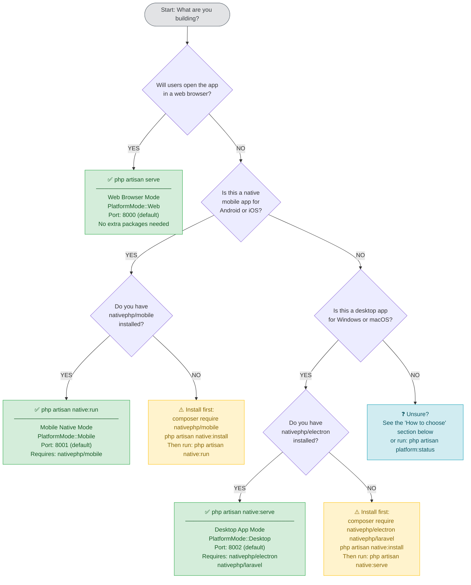

# Command Usage Decision Tree

This document helps you choose the correct Artisan command for your target platform and provides troubleshooting guidance for the most common errors.

---

## Decision Flowchart

Use this flowchart to select the right command. Follow the arrows from the top until you reach a command box.



---

## ASCII Fallback

If your Markdown renderer does not support Mermaid, use this ASCII version:

```
┌──────────────────────────────────────────────────────────────────────┐
│               What platform are you targeting?                       │
└──────────────────────────────────────────────────────────────────────┘
                                │
         ┌──────────────────────┼──────────────────────┐
         │                      │                      │
         ▼                      ▼                      ▼
   Web browser?          Android / iOS          Windows / macOS
                         native app?            desktop app?
         │                      │                      │
         │               nativephp/mobile         nativephp/electron
         │               installed?               nativephp/laravel
         │                 /    \                  installed?
         │               YES     NO                /    \
         │                │      │               YES     NO
         │                │      ▼                │      │
         │                │  composer require     │      ▼
         │                │  nativephp/mobile     │  composer require
         │                │  (then retry)         │  nativephp/electron
         │                │                       │  nativephp/laravel
         │                │                       │  (then retry)
         ▼                ▼                       ▼
  php artisan      php artisan             php artisan
     serve           native:run             native:serve
```

---

## How to Choose

### Use `php artisan serve` when…

- You are developing a standard web application accessed via a browser.
- You want to run the app on a remote server accessible by URL.
- You need WebRTC-based camera access (browser `getUserMedia`).
- You are testing Filament admin panels or user dashboards.
- You do not need native OS integrations (file system, push notifications, system tray).

```bash
php artisan serve
# Default: http://localhost:8000
```

No extra Composer packages are required. This is the standard Laravel workflow.

---

### Use `php artisan native:run` when…

- You are building a native mobile app that will be distributed on the **Google Play Store** or **Apple App Store**.
- You need native mobile APIs: camera, push notifications, biometric auth, app badges.
- The app will be installed directly on Android phones/tablets or iPhones/iPads.
- You need the session to survive app restarts (use `SESSION_DRIVER=database`).

```bash
php artisan native:run          # auto-detect device
php artisan native:run android  # Android only
php artisan native:run ios      # iOS only (macOS required)
```

**Required packages:** `nativephp/mobile`

---

### Use `php artisan native:serve` when…

- You are building a desktop application that will run as a **native `.exe`** (Windows) or **`.app`** (macOS).
- You need Electron APIs: desktop notifications, file system access, auto-updates, system tray.
- The app window should behave like a native desktop program (not a browser tab).
- You need single-user local file system access.

```bash
php artisan native:serve
```

**Required packages:** `nativephp/electron`, `nativephp/laravel`

---

## Command Comparison at a Glance

| | `artisan serve` | `artisan native:run` | `artisan native:serve` |
|---|---|---|---|
| Target environment | Web browser | Android / iOS | Windows / macOS desktop |
| PlatformMode | `Web` | `Mobile` | `Desktop` |
| Default port | 8000 | 8001 | 8002 |
| Extra packages | None | `nativephp/mobile` | `nativephp/electron` + `nativephp/laravel` |
| Camera API | WebRTC getUserMedia | NativePHP Mobile Camera | NativePHP Electron Camera |
| Env override file | `.env.web` | `.env.mobile` | `.env.desktop` |
| Asset directory | `public/build/web` | `public/build/mobile` | `public/build/desktop` |
| Session driver | `cookie` | `database` | `file` |
| Platform-specific routes | `routes/web.php` | `routes/mobile.php` | `routes/desktop.php` |

---

## Before You Run Any Command

### 1. Compile assets for the target platform

```bash
npm run build:web      # before php artisan serve
npm run build:mobile   # before php artisan native:run
npm run build:desktop  # before php artisan native:serve
```

During development, use the HMR dev server instead:

```bash
npm run dev:web        # port 5173
npm run dev:mobile     # port 5174
npm run dev:desktop    # port 5175
```

### 2. Copy the platform environment file (optional but recommended)

```bash
cp .env.web.example .env.web
cp .env.mobile.example .env.mobile
cp .env.desktop.example .env.desktop
```

Customise each file for its platform. At minimum, set `APP_URL` and `APP_PORT` correctly.

### 3. Check active state at any time

```bash
php artisan platform:status
```

Outputs the detected mode, runtime platform, loaded environment file, asset directory, and available features.

---

## Troubleshooting

### Error: Missing NativePHP Dependencies

**Symptom**

```
Error: Required dependencies for Mobile Native mode are not installed.

Missing packages:
  - nativephp/mobile

To install, run:
  composer require nativephp/mobile
```

**Cause:** `native:run` or `native:serve` was executed before the required Composer packages were installed.

**Fix**

```bash
# Mobile mode
composer require nativephp/mobile
php artisan native:install

# Desktop mode
composer require nativephp/electron nativephp/laravel
php artisan native:install
```

**Tip:** Use the validation wrapper commands to catch missing packages before starting:

```bash
php artisan platform:native:run     # validates then proxies native:run
php artisan platform:native:serve   # validates then proxies native:serve
```

---

### Error: Address Already in Use (Wrong Port)

**Symptom**

```
Failed to listen on 127.0.0.1:8000 (reason: Address already in use)
```

Or the NativePHP app opens a blank window without error.

**Cause:** Another process is already bound to the port.

**Fix — find and kill the conflicting process**

```bash
# Windows
netstat -ano | findstr :8000
taskkill /PID <pid> /F

# macOS / Linux
lsof -i :8000
kill -9 <pid>
```

**Fix — use a different port**

```bash
php artisan serve --port=8080
```

For NativePHP modes, edit the relevant environment file:

```dotenv
# .env.mobile
APP_PORT=8001

# .env.desktop
NATIVEPHP_HTTP_PORT=8002
APP_URL=http://localhost:8002
```

---

### Error: Platform Environment File Not Applied

**Symptom:** Platform-specific settings (`SESSION_DRIVER`, `APP_URL`, etc.) from `.env.mobile` or `.env.desktop` are not taking effect, even after creating the file.

**Log entry:**

```
[debug] Platform environment file not found, using base environment
        {"file":".env.mobile","mode":"mobile"}
```

**Cause:** The file does not exist at the project root, or has the wrong name / casing.

**Fix**

```bash
# Verify the file exists at project root (same level as composer.json)
ls -la .env*
# Expected: .env  .env.web  .env.mobile  .env.desktop

# Create from examples if missing
cp .env.web.example .env.web
cp .env.mobile.example .env.mobile
cp .env.desktop.example .env.desktop
```

Common mistakes:

- File placed inside a subdirectory (must be at the project root).
- Incorrect casing — filename must be lowercase: `.env.mobile`, not `.env.Mobile`.
- Only the `.example` file was created but not renamed.

---

### Error: Assets Not Found (404 on JS/CSS or Blank Page)

**Symptom**

```
GET /build/mobile/assets/app-mobile.abc12345.js  404 Not Found
```

Or the page loads with missing styles / Vite manifest error in the browser console.

**Cause:** Assets were not compiled for the active platform mode, or a different platform's build directory is being read.

**Fix**

```bash
# Compile for the platform you are serving
npm run build:web      # for php artisan serve
npm run build:mobile   # for php artisan native:run
npm run build:desktop  # for php artisan native:serve
```

**Diagnose:** Check which manifest path the application is reading:

```bash
php artisan platform:status
# Output includes: "Asset directory: public/build/<platform>"
# and whether manifest.json exists at that path
```

---

### Error: Platform Always Detected as Web (Unexpected `WebsiteWindows`)

**Symptom:** `php artisan platform:status` shows `PlatformMode: Web` even though you started the app with `native:run` or `native:serve`. Native camera and notifications are unavailable.

**Cause:** `PlatformCommandDetector` reads `$_SERVER['argv']` to identify the Artisan command. Detection falls back to Web mode when:

- The command name in `argv[1]` does not exactly match `serve`, `native:run`, or `native:serve`.
- The app was not started via the Artisan CLI (e.g., direct PHP process).
- The native runtime environment variables (`NATIVEPHP_RUNNING`, `NATIVE_MOBILE_RUNNING`) are not set.

**Fix**

1. Check the log for a warning entry:

   ```bash
   tail -n 50 storage/logs/laravel.log | grep "Platform detection"
   ```

2. Ensure native runtime env vars are set in the platform env file:

   ```dotenv
   # .env.desktop (NativePHP Electron sets this automatically)
   NATIVEPHP_RUNNING=true

   # .env.mobile (NativePHP Mobile sets this automatically)
   NATIVE_MOBILE_RUNNING=true
   ```

3. Clear any stale platform cache:

   ```bash
   php artisan platform:clear
   ```

4. Re-run the command directly from the terminal rather than through an IDE launcher that may alter `argv`.

---

### Error: `native:run` or `native:serve` Command Not Found

**Symptom**

```
Command "native:run" is not defined.
```

**Cause:** The NativePHP package is not installed and has not registered its Artisan commands.

**Fix**

```bash
# For native:run
composer require nativephp/mobile

# For native:serve
composer require nativephp/electron nativephp/laravel

# Then install NativePHP scaffolding
php artisan native:install
```

---

### Error: iOS Build Fails — Xcode / devicectl Not Found

**Symptom**

```
Error: Xcode command line tools not found.
```

Or `native:run ios` exits immediately without deploying.

**Cause:** iOS builds require macOS with Xcode installed.

**Fix**

- Install Xcode from the Mac App Store.
- Accept the Xcode license: `sudo xcodebuild -license accept`.
- Install command line tools: `xcode-select --install`.
- Ensure `devicectl` is available: `xcrun devicectl --version`.

iOS builds are **macOS-only**. Use an Android emulator on Windows/Linux for cross-platform mobile testing.

---

### Error: Electron Window Opens but Shows Blank White Page

**Symptom:** The NativePHP Electron app opens, but the window is blank or shows a connection error.

**Cause:** The embedded PHP server failed to start, or assets were not compiled for the desktop platform.

**Diagnosis steps:**

```bash
# 1. Check the Laravel log for startup errors
tail -n 100 storage/logs/laravel.log

# 2. Verify desktop assets exist
ls public/build/desktop/

# 3. Check if port 8002 is free
lsof -i :8002       # macOS/Linux
netstat -ano | findstr :8002   # Windows

# 4. Inspect active platform state
php artisan platform:status
```

**Fix**

```bash
# Compile desktop assets
npm run build:desktop

# Clear platform cache and retry
php artisan platform:clear
php artisan native:serve
```

---

### Error: Route Not Found (404) for Mobile or Desktop Endpoint

**Symptom:** A request to `/api/mobile/camera/capture` or `/api/desktop/file/save` returns 404.

**Cause:** Platform-specific routes are only registered when the matching platform mode is active. Accessing a mobile route from a web browser or desktop app returns 404 by design.

**Expected behavior:**

| Route prefix | Only accessible from |
|---|---|
| `/api/mobile/*` | `php artisan native:run` |
| `/api/desktop/*` | `php artisan native:serve` |

**Fix:** Ensure you started the server with the correct command for the route you are testing.

**Debug:** List all registered routes for the current mode:

```bash
php artisan route:list --path=api/mobile
php artisan route:list --path=api/desktop
```

If the routes do not appear, the platform mode was not detected correctly. Run `php artisan platform:status` and check the mode reported.

---

## Quick Reference Card

```
WHAT DO YOU NEED?                    COMMAND TO RUN
─────────────────────────────────    ─────────────────────────────
Serve to a web browser               php artisan serve
Deploy to Android device             php artisan native:run android
Deploy to iOS device                 php artisan native:run ios
Run as desktop app (Windows/macOS)   php artisan native:serve
Check active platform mode           php artisan platform:status
Clear platform cache / stale state   php artisan platform:clear
Validate mobile dependencies         php artisan platform:native:run
Validate desktop dependencies        php artisan platform:native:serve
```

---

## See Also

- [Platform Support Architecture](./platform-support.md) — component overview, data flow, RuntimePlatform enum
- [Environment Configuration Strategy](./environment-configuration.md) — `.env.*` file structure and merge rules
- [Asset Compilation Process](./asset-compilation.md) — Vite build pipeline and HMR setup
- [Platform Feature Matrix](./platform-features.md) — feature availability per platform and how to check it
- [Full Command Guide](./command-guide.md) — detailed command reference with all flags and options
