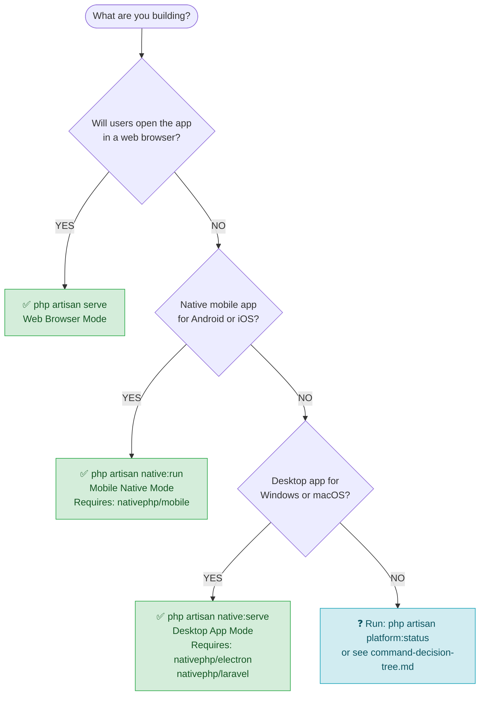

# Command Usage Guide

This guide helps you pick the correct Artisan command for your target platform, explains what each command needs to work, and provides a troubleshooting reference for the most common problems you will encounter.

---

## Quick Decision Tree

Use the flowchart below to select the right command. For a standalone decision tree document with full Mermaid diagram and troubleshooting quick-reference, see [command-decision-tree.md](./command-decision-tree.md).



Still unsure? Ask yourself:

1. **Will users open the app in a browser (Chrome, Safari, Firefox)?**
   → `php artisan serve`

2. **Will the app be installed on an Android phone or iPhone / iPad?**
   → `php artisan native:run`

3. **Will the app ship as a `.exe` (Windows) or `.app` (macOS) desktop program?**
   → `php artisan native:serve`

---

## Command Reference

### `php artisan serve` — Web Browser Mode

Starts the standard Laravel HTTP development server on `http://localhost:8000`.

```bash
php artisan serve

# Override the port
php artisan serve --port=8080

# Listen on all interfaces (useful for LAN access)
php artisan serve --host=0.0.0.0 --port=8000
```

**Platform mode initialised:** `PlatformMode::Web`

**RuntimePlatform cases detected at request time:**

| User Agent | RuntimePlatform case |
|------------|---------------------|
| Windows / Linux browser | `WebsiteWindows` |
| macOS browser | `WebsiteMacOS` |
| Android browser | `WebsiteAndroid` |
| iPhone / iPad browser | `WebsiteIos` |

**What gets configured automatically:**

- Environment: merges `.env.web` (if present) on top of `.env`
- Assets: reads `public/build/web/manifest.json`
- Session driver: `cookie` (when `.env.web` has `SESSION_DRIVER=cookie`)
- Camera: WebRTC `getUserMedia` API

**Prerequisites:**

- PHP 8.2+ CLI
- Composer dependencies installed (`composer install`)
- Web assets compiled (`npm run build:web`) — or Vite dev server running (`npm run dev:web`)
- `.env` file present at project root
- Optional: `.env.web` for web-specific overrides

No additional Composer packages are required beyond a standard Laravel installation.

---

### `php artisan native:run` — Mobile Native Mode (Android / iOS)

Builds, packages, and deploys the app to an Android device / emulator or iOS device / simulator. The Laravel HTTP server runs embedded inside the native app process.

```bash
# Auto-detect platform (Android on Windows/Linux, prompts on macOS)
php artisan native:run

# Target Android explicitly (auto-prefers a connected physical device)
php artisan native:run android

# Target iOS explicitly (macOS only)
php artisan native:run ios

# Target a specific device by ADB serial
php artisan native:run android <udid>

# Enable hot reloading during development
php artisan native:run --watch

# Release build
php artisan native:run android --build=release

# Android App Bundle (for Play Store)
php artisan native:run android --build=bundle
```

**Platform mode initialised:** `PlatformMode::Mobile`

**RuntimePlatform cases produced:**

- `MobileAppAndroid` — Android device or emulator
- `MobileAppIos` — iPhone or iPad

**What gets configured automatically:**

- Environment: merges `.env.mobile` (if present) on top of `.env`
- Assets: reads `public/build/mobile/manifest.json`
- Session driver: `database` (recommended for mobile — survives app restarts)
- Camera: NativePHP Mobile Camera API (not WebRTC)
- Routes: loads `routes/mobile.php` in addition to standard routes

**Prerequisites:**

| Requirement | Details |
|-------------|---------|
| `nativephp/mobile` Composer package | `composer require nativephp/mobile` |
| `NATIVEPHP_APP_ID` in `.env` | e.g. `com.example.weddingorganizer` — must not be the default |
| Android SDK + ADB | Required for Android targets; add to `PATH` |
| Xcode + `devicectl` | Required for iOS targets; macOS only |
| Mobile assets compiled | `npm run build:mobile` (or `npm run dev:mobile` for HMR) |
| Optional: `.env.mobile` | Override `APP_URL`, `SESSION_DRIVER`, port, etc. |

Run `php artisan platform:native:run` (the validation wrapper) to get a human-readable error listing any missing packages before the real command runs.

---

### `php artisan native:serve` — Desktop App Mode (Windows / macOS)

Starts the NativePHP Electron desktop application. Electron wraps the embedded PHP HTTP server and opens an app window pointing to the Laravel backend.

```bash
# Start the desktop app
php artisan native:serve

# Skip the queue worker
php artisan native:serve --without-queue

# Skip the scheduler
php artisan native:serve --without-schedule

# Suppress Laravel log output from the console
php artisan native:serve --quiet-logs
```

**Platform mode initialised:** `PlatformMode::Desktop`

**RuntimePlatform cases produced:**

- `DesktopAppWindows` — Windows PC
- `DesktopAppMacOS` — macOS

**What gets configured automatically:**

- Environment: merges `.env.desktop` (if present) on top of `.env`
- Assets: reads `public/build/desktop/manifest.json`
- Session driver: `file` (single-user local process)
- Camera: NativePHP Electron Camera API (not WebRTC)
- Routes: loads `routes/desktop.php` in addition to standard routes

**Prerequisites:**

| Requirement | Details |
|-------------|---------|
| `nativephp/electron` Composer package | `composer require nativephp/electron` |
| `nativephp/laravel` Composer package | `composer require nativephp/laravel` |
| Node.js + Electron toolchain | Installed automatically by `nativephp/electron` |
| Desktop assets compiled | `npm run build:desktop` (or `npm run dev:desktop` for HMR) |
| Optional: `.env.desktop` | Override `APP_URL`, `NATIVEPHP_HTTP_PORT`, session driver, etc. |

Run `php artisan platform:native:serve` (the validation wrapper) to get a human-readable error listing any missing packages before the real command runs.

---

## Side-by-Side Comparison

| | `artisan serve` | `artisan native:run` | `artisan native:serve` |
|---|---|---|---|
| Target | Web browsers | Android / iOS | Windows / macOS desktop |
| PlatformMode | `Web` | `Mobile` | `Desktop` |
| RuntimePlatform | WebsiteWindows/MacOS/Android/Ios | MobileAppAndroid/Ios | DesktopAppWindows/MacOS |
| Env override file | `.env.web` | `.env.mobile` | `.env.desktop` |
| Asset directory | `public/build/web` | `public/build/mobile` | `public/build/desktop` |
| Camera API | WebRTC getUserMedia | NativePHP Mobile Camera | NativePHP Electron Camera |
| Default port | 8000 | 8001 | 8002 |
| Extra packages needed | None | `nativephp/mobile` | `nativephp/electron`, `nativephp/laravel` |
| Platform-specific routes | `routes/web.php` | `routes/mobile.php` | `routes/desktop.php` |

---

## Recommended Development Workflow

During development you can run all three platforms simultaneously by opening three terminal windows, one per platform. Each uses a different port so they do not conflict.

### Terminal 1 — Web (port 8000)

```bash
# Start the Vite dev server with HMR for web
npm run dev:web

# In a separate tab: start the Laravel HTTP server
php artisan serve --port=8000
```

### Terminal 2 — Mobile (port 8001)

```bash
# Start the Vite dev server with HMR for mobile
npm run dev:mobile

# Build and deploy to connected Android device (with hot reload)
php artisan native:run android --watch
```

### Terminal 3 — Desktop (port 8002)

```bash
# Start the Vite dev server with HMR for desktop
npm run dev:desktop

# Start the Electron desktop app
php artisan native:serve
```

### Port Assignment Convention

| Platform | Laravel port | Vite HMR port |
|----------|-------------|--------------|
| Web | 8000 | 5173 |
| Mobile | 8001 | 5174 |
| Desktop | 8002 | 5175 |

Ports are set in `.env.web`, `.env.mobile`, and `.env.desktop`. Override a Vite port via `VITE_PORT` before the npm command:

```bash
VITE_PORT=5200 npm run dev:web
```

### Check What Is Currently Active

At any time you can inspect the active platform mode and feature set:

```bash
php artisan platform:status
```

This outputs the detected mode, runtime platform, loaded environment file, active asset directory, and available features.

### Switch Modes During Development

When you switch between platforms, clear the cached routes and platform detection state so stale data does not carry over:

```bash
php artisan platform:clear
```

This flushes cached routes and any platform detection singletons.

---

## Build Commands Reference

Compile assets for a platform before serving in production, or when starting a new development session without HMR:

```bash
# Build only the web bundle
npm run build:web

# Build only the mobile bundle
npm run build:mobile

# Build only the desktop bundle
npm run build:desktop

# Build all three in sequence
npm run build:all
```

Output directories:

```
public/
  build/
    web/        ← used by php artisan serve
    mobile/     ← used by php artisan native:run
    desktop/    ← used by php artisan native:serve
```

---

## Troubleshooting

### 1. Missing NativePHP Dependencies

**Symptom:**

```
Error: Required dependencies for Mobile Native mode are not installed.

Missing packages:
  - nativephp/mobile

To install, run:
  composer require nativephp/mobile
```

Or for Desktop mode:

```
Error: Required dependencies for Desktop Application mode are not installed.

Missing packages:
  - nativephp/electron
  - nativephp/laravel

To install, run:
  composer require nativephp/electron nativephp/laravel
```

**Cause:** You ran `native:run` or `native:serve` before installing the required Composer packages.

**Fix:**

```bash
# For Mobile mode
composer require nativephp/mobile

# For Desktop mode
composer require nativephp/electron nativephp/laravel
```

After installing, run `php artisan native:install` to set up the NativePHP project structure, then retry your command.

Use the validation wrappers to get this error early and with clear instructions:

```bash
php artisan platform:native:run     # validation wrapper for native:run
php artisan platform:native:serve   # validation wrapper for native:serve
```

---

### 2. Wrong Port — Address Already in Use

**Symptom:**

```
Failed to listen on 127.0.0.1:8000 (reason: Address already in use)
```

Or in a NativePHP app, the embedded server silently fails to start and the app shows a blank page.

**Cause:** Another process is already bound to the port — often another `php artisan serve` instance or a previous NativePHP session.

**Fix:**

```bash
# Find what is using the port (Windows)
netstat -ano | findstr :8000

# Find what is using the port (macOS / Linux)
lsof -i :8000

# Kill the conflicting process (Windows, PID from above)
taskkill /PID <pid> /F

# Kill the conflicting process (macOS / Linux)
kill -9 <pid>
```

Alternatively, specify a different port:

```bash
php artisan serve --port=8080
```

For NativePHP modes, change `APP_PORT` and `NATIVEPHP_HTTP_PORT` (Desktop) or `NATIVE_SERVER_PORT` (Mobile) in the relevant `.env.*` file.

---

### 3. Environment File Not Found

**Symptom:** Platform-specific settings (session driver, `APP_URL`, port) are not applied even though you created a `.env.mobile` or `.env.desktop` file.

Or in logs:

```
[debug] Platform environment file not found, using base environment  {"file":".env.mobile","mode":"mobile"}
```

**Cause:** The platform env file does not exist at the project root, or has a wrong name. Common mistakes:

- File placed in a subdirectory instead of the project root.
- Typo in the filename (`.env.Mobile` vs `.env.mobile`).
- Only the `.example` file was copied but not renamed.

**Fix:**

```bash
# Copy the example files (run from project root)
cp .env.web.example .env.web
cp .env.mobile.example .env.mobile
cp .env.desktop.example .env.desktop
```

Verify location: all four files (`.env`, `.env.web`, `.env.mobile`, `.env.desktop`) must sit at the same level as `composer.json`.

Check the `EnvironmentManager` debug log in `storage/logs/laravel.log` to confirm which file was searched for and whether it was found.

---

### 4. Assets Not Compiled — 404 on JS/CSS or Blank Page

**Symptom:**

```
GET /build/mobile/assets/app-mobile.abc12345.js  404 Not Found
```

Or the page loads but with no styles, no interactivity, or a Vite manifest error in the browser console.

**Cause:** The asset bundle for the active platform mode has not been compiled yet, or was compiled for a different platform.

**Fix:**

```bash
# Compile assets for the platform you are serving
npm run build:web      # for php artisan serve
npm run build:mobile   # for php artisan native:run
npm run build:desktop  # for php artisan native:serve
```

For development with live reloading, run the matching dev server instead:

```bash
npm run dev:web        # port 5173
npm run dev:mobile     # port 5174
npm run dev:desktop    # port 5175
```

To confirm which manifest path the application is reading:

```bash
php artisan platform:status
```

The output shows `Asset directory: public/build/<platform>` and whether `manifest.json` exists at that path.

---

### 5. Platform Detection Defaulting to Web (Unexpected `WebsiteWindows`)

**Symptom:** The application behaves as if it is running in Web mode even though you started it with `native:run` or `native:serve`. Features like native camera access are unavailable, and `php artisan platform:status` reports `PlatformMode: Web`.

**Cause:** `PlatformCommandDetector` reads `$_SERVER['argv']` to identify the Artisan command. If the command name in `argv[1]` does not exactly match `serve`, `native:run`, or `native:serve`, detection falls back to Web mode. This can happen when:

- The command was not run through the Artisan CLI (e.g., launched directly as an HTTP process).
- A wrapper script changes `argv[0]` so `artisan` is not detected.
- Environment variables `NATIVEPHP_RUNNING`, `ELECTRON_RUN_AS_NODE`, or `NATIVE_MOBILE_RUNNING` are unset when running inside the native runtime.

**Fix:**

1. Check `storage/logs/laravel.log` for a `Platform detection failed` warning entry — it contains the underlying exception.

2. For HTTP / embedded server fallback, ensure the native runtime sets the correct environment variable:

   ```dotenv
   # In .env.desktop — set by NativePHP Electron automatically
   NATIVEPHP_RUNNING=true

   # In .env.mobile — set by NativePHP Mobile automatically
   NATIVE_MOBILE_RUNNING=true
   ```

3. Re-run the command directly from the terminal rather than through a launcher or IDE run configuration, which may strip or alter `argv`.

4. Run `php artisan platform:clear` then retry. A stale cached route file from a previous Web-mode session can cause the application to behave as if the mode is Web even after the command changes.

---

## See Also

- [Command Usage Decision Tree](./command-decision-tree.md) — flowchart for choosing the right command with troubleshooting quick-reference
- [Platform Support Architecture](./platform-support.md) — component overview and data flow
- [Environment Configuration Strategy](./environment-configuration.md) — `.env.*` file structure and merge rules
- [Asset Compilation Process](./asset-compilation.md) — Vite build pipeline and HMR setup
- [Platform Feature Matrix](./platform-features.md) — feature availability per platform
- `php artisan platform:status` — inspect active mode, runtime platform, and features
- `php artisan platform:clear` — flush cached routes and platform state
