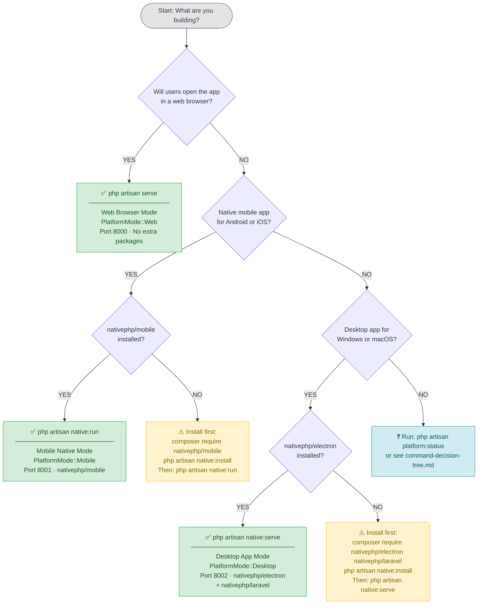

# Platform Support Architecture

This document covers how the Laravel Wedding Organizer CBIR application handles three distinct runtime environments: web browsers, native mobile apps, and native desktop apps. Each environment is started with a specific Artisan command and gets its own environment configuration, asset bundle, and feature set.

---

## Platform Modes

The application supports three platform modes, each triggered by a dedicated Artisan command.

### Web Server Mode

```bash
php artisan serve
```

Serves the application for web browsers over HTTP. Uses standard Laravel session/cookie handling and WebRTC for camera access. Ideal for development and web-only deployments.

**RuntimePlatform cases produced:**
- `WebsiteWindows` — Windows/Linux desktop browsers
- `WebsiteMacOS` — macOS Safari/Chrome/Firefox
- `WebsiteAndroid` — Chrome/Firefox on Android
- `WebsiteIos` — Safari on iPhone/iPad

### Mobile Native Mode

```bash
php artisan native:run
```

Starts the application embedded inside a NativePHP Mobile wrapper targeting Android and iOS. The Laravel HTTP server runs locally within the app process. Requires the `laravel-native` mobile package.

**RuntimePlatform cases produced:**
- `MobileAppAndroid`
- `MobileAppIos`

### Desktop App Mode

```bash
php artisan native:serve
```

Starts the application inside an Electron (NativePHP Desktop) window on Windows or macOS. The PHP server runs as a background process inside the Electron app. Requires the `nativephp/electron` package.

**RuntimePlatform cases produced:**
- `DesktopAppWindows`
- `DesktopAppMacOS`

---

## The RuntimePlatform Enum

`App\Enums\RuntimePlatform` represents the eight specific runtime cases the application can operate in. It sits one level below `PlatformMode` — the mode tells you *which command started the app*, while `RuntimePlatform` tells you *what device/OS is actually running it*.

```php
enum RuntimePlatform: string
{
    // Web mode → 4 website cases
    case WebsiteWindows  = 'website_windows';
    case WebsiteMacOS    = 'website_macos';
    case WebsiteAndroid  = 'website_android';
    case WebsiteIos      = 'website_ios';

    // Mobile mode → 2 mobile app cases
    case MobileAppAndroid = 'mobile_app_android';
    case MobileAppIos     = 'mobile_app_ios';

    // Desktop mode → 2 desktop app cases
    case DesktopAppWindows = 'desktop_app_windows';
    case DesktopAppMacOS   = 'desktop_app_macos';
}
```

### Relationship to PlatformMode

| PlatformMode | RuntimePlatform cases |
|---|---|
| `Web` | `WebsiteWindows`, `WebsiteMacOS`, `WebsiteAndroid`, `WebsiteIos` |
| `Mobile` | `MobileAppAndroid`, `MobileAppIos` |
| `Desktop` | `DesktopAppWindows`, `DesktopAppMacOS` |

### Category helper methods

The enum exposes three mutually exclusive category methods. Exactly one returns `true` for any given case:

```php
$platform->isWebsite();    // true for all Website* cases
$platform->isMobileApp();  // true for MobileApp* cases
$platform->isDesktopApp(); // true for DesktopApp* cases
```

### Feature helper methods

```php
$platform->hasNativeCameraAccess();  // MobileApp* + DesktopApp*
$platform->hasWebRTCAccess();        // Website* only
$platform->hasFileSystemAccess();    // MobileApp* + DesktopApp*
$platform->hasDesktopNotifications();// DesktopApp* only
$platform->hasPushNotifications();   // MobileApp* only
$platform->hasAutoUpdates();         // DesktopApp* only
$platform->hasAppBadge();            // MobileApp* only

// Delegates to PlatformFeatureRegistry:
$platform->hasFeature('camera');
$platform->getAvailableFeatures();   // returns string[]
```

### CBIR camera mode

```php
$platform->cbirCameraMode(); // 'native' (mobile/desktop) or 'webrtc' (website)
```

Use this to decide which camera API to invoke for the CBIR search feature.

---

## Component Overview

### PlatformCommandDetector

**Location:** `app/Support/Platform/PlatformCommandDetector.php`

Reads `$_SERVER['argv']` during application bootstrap to identify which Artisan command was executed, then maps it to a `PlatformMode` value.

| Command | Detected Mode |
|---|---|
| `artisan serve` | `PlatformMode::Web` |
| `artisan native:run` | `PlatformMode::Mobile` |
| `artisan native:serve` | `PlatformMode::Desktop` |
| Any other `artisan native:*` | `PlatformMode::Desktop` |
| No artisan / HTTP request | Falls back to runtime detection |

When not running through Artisan (e.g., embedded HTTP request), it falls back to checking env variables:
- `NATIVEPHP_RUNNING` or `ELECTRON_RUN_AS_NODE` → Desktop
- `NATIVE_MOBILE_RUNNING` → Mobile
- Otherwise → Web

```php
// The single public entry point
$mode = PlatformCommandDetector::detectMode(); // PlatformMode
```

---

### RuntimePlatformDetector

**Location:** `app/Support/Platform/RuntimePlatformDetector.php`

Given a `PlatformMode` and an optional HTTP `Request`, narrows the mode down to the exact `RuntimePlatform` case.

- **Web mode** — parses the `User-Agent` header for `iphone/ipad/ipod` (→ iOS), `android` (→ Android), `mac/darwin` (→ macOS), default (→ Windows).
- **Mobile mode** — queries `\Native\Mobile\Device::platform()` if available; falls back to `config('native.platform', 'android')`.
- **Desktop mode** — checks `PHP_OS_FAMILY`; `Darwin` → macOS, anything else → Windows.

On any exception the detector logs a warning and returns `RuntimePlatform::WebsiteWindows`.

```php
$detector = app(RuntimePlatformDetector::class);
$runtime  = $detector->detect($mode, $request); // RuntimePlatform
```

---

### EnvironmentManager

**Location:** `app/Support/Platform/EnvironmentManager.php`

Loads and merges a platform-specific `.env.{mode}` file on top of the already-loaded base `.env`. Platform-specific values take precedence.

| Platform Mode | File loaded |
|---|---|
| Web | `.env.web` |
| Mobile | `.env.mobile` |
| Desktop | `.env.desktop` |

If the file doesn't exist the manager logs a debug message and continues without error.

```php
$envManager = app(EnvironmentManager::class);
$envManager->loadPlatformEnvironment($mode);

// Check if platform env file is present
$envManager->platformEnvironmentExists($mode); // bool
```

Example `.env.mobile`:

```env
APP_URL=http://10.0.2.2:8000
VITE_PLATFORM=mobile
SESSION_DRIVER=database
```

---

### PlatformAssetManager

**Location:** `app/Support/Platform/PlatformAssetManager.php`

Resolves platform-specific Vite build output paths and manifest entries.

| Platform Mode | Build directory | Vite entry point |
|---|---|---|
| Web | `public/build/web` | `resources/js/app-web.js` |
| Mobile | `public/build/mobile` | `resources/js/app-mobile.js` |
| Desktop | `public/build/desktop` | `resources/js/app-desktop.js` |

```php
$assetManager = app(PlatformAssetManager::class);
$assetManager->configure($mode);

$assetManager->getBuildDirectory();  // e.g. "build/web"
$assetManager->getManifestPath();    // absolute path to manifest.json
$assetManager->getViteInput();       // e.g. "resources/js/app-web.js"
$assetManager->asset('resources/js/app-web.js'); // versioned URL
$assetManager->manifestExists();     // bool
```

---

### PlatformFeatureRegistry

**Location:** `app/Support/Platform/PlatformFeatureRegistry.php`

Maintains a static feature matrix that maps feature names to the `RuntimePlatform` cases that support them.

```php
$registry = app(PlatformFeatureRegistry::class);

// Check a single feature
$registry->isAvailable('camera', RuntimePlatform::MobileAppAndroid); // true
$registry->isAvailable('webrtc', RuntimePlatform::DesktopAppWindows); // false

// Get all features for a platform
$registry->getAvailableFeatures(RuntimePlatform::DesktopAppMacOS);
// ['camera', 'desktop_notifications', 'file_system', 'auto_updates']

// Get all platforms for a feature
$registry->getPlatformsForFeature('push_notifications');
// [RuntimePlatform::MobileAppAndroid, RuntimePlatform::MobileAppIos]
```

Feature availability matrix:

| Feature | WebsiteWindows | WebsiteMacOS | WebsiteAndroid | WebsiteIos | MobileAppAndroid | MobileAppIos | DesktopAppWindows | DesktopAppMacOS |
|---|:---:|:---:|:---:|:---:|:---:|:---:|:---:|:---:|
| `camera` | ❌ | ❌ | ❌ | ❌ | ✅ | ✅ | ✅ | ✅ |
| `webrtc` | ✅ | ✅ | ✅ | ✅ | ❌ | ❌ | ❌ | ❌ |
| `file_system` | ❌ | ❌ | ❌ | ❌ | ✅ | ✅ | ✅ | ✅ |
| `desktop_notifications` | ❌ | ❌ | ❌ | ❌ | ❌ | ❌ | ✅ | ✅ |
| `push_notifications` | ❌ | ❌ | ❌ | ❌ | ✅ | ✅ | ❌ | ❌ |
| `auto_updates` | ❌ | ❌ | ❌ | ❌ | ❌ | ❌ | ✅ | ✅ |
| `app_badge` | ❌ | ❌ | ❌ | ❌ | ✅ | ✅ | ❌ | ❌ |

---

### PlatformModeServiceProvider

**Location:** `app/Providers/PlatformModeServiceProvider.php`

The glue that wires everything together during application bootstrap. It must be registered **before** `RouteServiceProvider` so the `platform.mode` singleton is available when conditional routes are loaded.

**`register()` phase** (before boot):
- Calls `PlatformCommandDetector::detectMode()` and binds the result as `app('platform.mode')`
- Registers `RuntimePlatformDetector`, `EnvironmentManager`, and `PlatformAssetManager` as singletons

**`boot()` phase** (after all providers registered):
1. Resolves `platform.mode`
2. Calls `EnvironmentManager::loadPlatformEnvironment($mode)` — merges `.env.{mode}`
3. Binds `app('runtime.platform')` by calling `RuntimePlatformDetector::detect($mode, $request)`
4. Calls `PlatformAssetManager::configure($mode)` — sets build directory
5. In `local` environment, logs all detection details to the Laravel log

---

## Data Flow

From command execution to a fully configured application:

```
1. Developer runs: php artisan native:run
       │
       ▼
2. PlatformCommandDetector reads argv[1] = "native:run"
   → returns PlatformMode::Mobile
       │
       ▼
3. PlatformModeServiceProvider::register()
   → binds app('platform.mode') = PlatformMode::Mobile
       │
       ▼
4. PlatformModeServiceProvider::boot()
   → EnvironmentManager loads .env.mobile
     (merges SESSION_DRIVER=database, APP_URL=..., etc.)
       │
       ▼
5. RuntimePlatformDetector::detect(PlatformMode::Mobile, null)
   → queries Native\Mobile\Device::platform()
   → returns RuntimePlatform::MobileAppAndroid (or MobileAppIos)
   → binds app('runtime.platform')
       │
       ▼
6. PlatformAssetManager::configure(PlatformMode::Mobile)
   → sets build directory to "build/mobile"
   → manifest path = public/build/mobile/manifest.json
       │
       ▼
7. RouteServiceProvider loads routes/mobile.php (mobile-only routes)
       │
       ▼
8. Views request assets via PlatformAssetManager::asset(...)
   → returns versioned URLs from build/mobile/manifest.json
```

In a sequence diagram:

```
artisan native:run
      │
      │ argv detection
      ▼
PlatformCommandDetector ──── PlatformMode::Mobile ────► PlatformModeServiceProvider
                                                               │
                               ┌───────────────────────────────┤
                               │                               │
                               ▼                               ▼
                       EnvironmentManager              RuntimePlatformDetector
                       (loads .env.mobile)             (returns MobileAppAndroid)
                               │                               │
                               └───────────────────────────────┤
                                                               │
                                                               ▼
                                                       PlatformAssetManager
                                                       (build/mobile)
                                                               │
                                                               ▼
                                                     Application fully configured
```

---

## Platform Feature Matrix

The table below shows every named feature tracked by `PlatformFeatureRegistry` and which of the eight `RuntimePlatform` cases support it.

> **Legend:** ✅ Available &nbsp;|&nbsp; ❌ Not available

| Feature | Web Win | Web macOS | Web Android | Web iOS | Mobile Android | Mobile iOS | Desktop Win | Desktop macOS |
|---|:---:|:---:|:---:|:---:|:---:|:---:|:---:|:---:|
| `camera` | ❌ | ❌ | ❌ | ❌ | ✅ | ✅ | ✅ | ✅ |
| `webrtc` | ✅ | ✅ | ✅ | ✅ | ❌ | ❌ | ❌ | ❌ |
| `file_system` | ❌ | ❌ | ❌ | ❌ | ✅ | ✅ | ✅ | ✅ |
| `desktop_notifications` | ❌ | ❌ | ❌ | ❌ | ❌ | ❌ | ✅ | ✅ |
| `push_notifications` | ❌ | ❌ | ❌ | ❌ | ✅ | ✅ | ❌ | ❌ |
| `auto_updates` | ❌ | ❌ | ❌ | ❌ | ❌ | ❌ | ✅ | ✅ |
| `app_badge` | ❌ | ❌ | ❌ | ❌ | ✅ | ✅ | ❌ | ❌ |

Column headers map to `RuntimePlatform` enum cases:

| Short label | `RuntimePlatform` case |
|---|---|
| Web Win | `WebsiteWindows` |
| Web macOS | `WebsiteMacOS` |
| Web Android | `WebsiteAndroid` |
| Web iOS | `WebsiteIos` |
| Mobile Android | `MobileAppAndroid` |
| Mobile iOS | `MobileAppIos` |
| Desktop Win | `DesktopAppWindows` |
| Desktop macOS | `DesktopAppMacOS` |

### Feature descriptions

| Feature | Description |
|---|---|
| `camera` | Native device camera access via NativePHP APIs (mobile sheet / desktop dialog) |
| `webrtc` | Browser-based camera access via `MediaDevices.getUserMedia()` |
| `file_system` | Read/write access to the local file system through NativePHP |
| `desktop_notifications` | OS-level desktop notification toasts (NativePHP Electron) |
| `push_notifications` | Remote push notifications delivered to the mobile app |
| `auto_updates` | In-app automatic update mechanism provided by NativePHP Electron |
| `app_badge` | Home-screen / dock badge counter on mobile |

### Grouped by platform category

| Feature | Website platforms | Mobile apps | Desktop apps |
|---|:---:|:---:|:---:|
| `camera` | ❌ | ✅ | ✅ |
| `webrtc` | ✅ | ❌ | ❌ |
| `file_system` | ❌ | ✅ | ✅ |
| `desktop_notifications` | ❌ | ❌ | ✅ |
| `push_notifications` | ❌ | ✅ | ❌ |
| `auto_updates` | ❌ | ❌ | ✅ |
| `app_badge` | ❌ | ✅ | ❌ |

---

## Checking Feature Availability in Code

There are three equivalent approaches for querying feature availability, depending on the context.

### 1. `platform_feature()` global helper (recommended for views and controllers)

`platform_feature(string $feature): bool` checks the feature against the **current** `RuntimePlatform` singleton resolved from the service container.

```php
// Simple boolean guard
if (platform_feature('camera')) {
    // Only reached on MobileApp* and DesktopApp* platforms
    $image = CameraService::capture();
}

if (platform_feature('webrtc')) {
    // Only reached on Website* platforms
}

if (platform_feature('file_system')) {
    // Only reached on MobileApp* and DesktopApp* platforms
    Storage::disk('local')->put('export.csv', $csv);
}

if (platform_feature('desktop_notifications')) {
    \Native\Laravel\Notification::title('Order updated')
        ->message('Your order status has changed.')
        ->send();
}

if (platform_feature('push_notifications')) {
    // Trigger FCM/APNs push via your mobile notification service
    $user->notify(new OrderStatusNotification($order));
}

if (platform_feature('auto_updates')) {
    // Show "Check for updates" menu item in the desktop app
}

if (platform_feature('app_badge')) {
    // Set unread-message badge count
}
```

### 2. `RuntimePlatform` enum methods (explicit, type-safe)

If you already hold a `RuntimePlatform` instance you can call the per-feature methods directly:

```php
$platform = runtime_platform();  // or app('runtime.platform')

$platform->hasNativeCameraAccess();   // camera feature
$platform->hasWebRTCAccess();         // webrtc feature
$platform->hasFileSystemAccess();     // file_system feature
$platform->hasDesktopNotifications(); // desktop_notifications feature
$platform->hasPushNotifications();    // push_notifications feature
$platform->hasAutoUpdates();          // auto_updates feature
$platform->hasAppBadge();             // app_badge feature

// Or delegate to the registry via hasFeature():
$platform->hasFeature('camera');
$platform->hasFeature('webrtc');
```

### 3. `PlatformFeatureRegistry` directly (useful in services and tests)

```php
use App\Support\Platform\PlatformFeatureRegistry;
use App\Enums\RuntimePlatform;

$registry = app(PlatformFeatureRegistry::class);

// Check one feature against one platform
$registry->isAvailable('camera', RuntimePlatform::MobileAppAndroid); // true
$registry->isAvailable('webrtc', RuntimePlatform::DesktopAppWindows); // false

// Get all features supported by a specific platform
$features = $registry->getAvailableFeatures(RuntimePlatform::DesktopAppMacOS);
// ['camera', 'desktop_notifications', 'file_system', 'auto_updates']

// Get all platforms that support a feature
$platforms = $registry->getPlatformsForFeature('push_notifications');
// [RuntimePlatform::MobileAppAndroid, RuntimePlatform::MobileAppIos]
```

### Combining feature checks with mode helpers

When you want to branch broadly by platform category and then fine-tune with specific features:

```php
// Broad mode check
if (is_mobile_mode()) {
    // Mobile-only setup — push notifications, camera, badges
    if (platform_feature('camera')) {
        // ... register native camera route bindings
    }
} elseif (is_desktop_mode()) {
    // Desktop-only setup — desktop notifications, auto-updates
    if (platform_feature('desktop_notifications')) {
        // ... register OS notification listeners
    }
} else {
    // Web fallback — WebRTC, browser session handling
    if (platform_feature('webrtc')) {
        // ... mount browser camera component
    }
}
```

### Feature checks in Blade templates

```blade
@if(platform_feature('camera'))
    <x-native-camera-button />
@elseif(platform_feature('webrtc'))
    <x-webrtc-camera-button />
@endif

@if(platform_feature('file_system'))
    <x-file-upload-button label="Browse files" />
@endif

@if(platform_feature('push_notifications'))
    <x-notification-opt-in-prompt />
@endif
```

### CBIR camera mode selection

For the Content-Based Image Retrieval feature use `cbirCameraMode()` to select the correct API in one call:

```php
$mode = runtime_platform()->cbirCameraMode(); // 'native' | 'webrtc'

match ($mode) {
    'native'  => $this->captureWithNativeCamera(),
    'webrtc'  => $this->captureWithWebRTC(),
};
```

---

## Quick Reference: Helper Functions

Using the helper functions defined in `app/helpers.php`:

```php
// Get the current platform mode
$mode = platform_mode();       // PlatformMode::Mobile
$mode->label();                // "Mobile Native"
$mode->environmentFile();      // ".env.mobile"
$mode->assetDirectory();       // "build/mobile"
$mode->allowsCameraAccess();   // true

// Get the specific runtime platform
$runtime = runtime_platform(); // RuntimePlatform::MobileAppAndroid
$runtime->label();             // "Mobile App (Android)"
$runtime->isMobileApp();       // true

// Check a feature
if (platform_feature('camera')) {
    // Show native camera UI
}

// Conditional platform logic
if (is_mobile_mode()) {
    // Mobile-specific code
} elseif (is_desktop_mode()) {
    // Desktop-specific code
} else {
    // Web fallback
}
```

Using the `RuntimePlatform` enum directly:

```php
$platform = app('runtime.platform');

// Branch on camera mode for CBIR
$cameraMode = $platform->cbirCameraMode(); // 'native' or 'webrtc'

if ($cameraMode === 'native') {
    // Use NativePHP camera sheet / dialog
} else {
    // Use browser MediaDevices.getUserMedia()
}
```

---

## Platform-Specific Routes

Routes can be registered conditionally in `RouteServiceProvider`:

```php
// routes/mobile.php — only loaded in Mobile mode
Route::middleware('api')->prefix('api/mobile')->group(function () {
    Route::post('/camera/capture', [PlatformCameraController::class, 'capture']);
});

// routes/desktop.php — only loaded in Desktop mode
Route::middleware('api')->prefix('api/desktop')->group(function () {
    Route::post('/file/save', [DesktopFileController::class, 'save']);
});
```

Accessing a mobile-only route from a web browser returns `404 Not Found`. The platform middleware/check is responsible for enforcing this.

---

## Vite Build Configuration

Each platform mode has its own Vite entry point and output directory. Run the appropriate build command before serving:

```bash
# Web
npx vite build --config vite.config.js -- --mode web

# Mobile
npx vite build --config vite.config.js -- --mode mobile

# Desktop
npx vite build --config vite.config.js -- --mode desktop
```

Output locations:

```
public/
  build/
    web/
      manifest.json
      assets/app-web.{hash}.js
      assets/app-web.{hash}.css
    mobile/
      manifest.json
      assets/app-mobile.{hash}.js
    desktop/
      manifest.json
      assets/app-desktop.{hash}.js
```

---

## Deciding Which Command to Use

Follow the flowchart below to pick the right Artisan command. For a standalone version with detailed "when to use" guidance and a full troubleshooting reference, see [command-decision-tree.md](./command-decision-tree.md).



### Quick reference

| Situation | Command |
|---|---|
| Standard web app in browser | `php artisan serve` |
| Android / iOS native app | `php artisan native:run` |
| Windows / macOS desktop app | `php artisan native:serve` |
| Check which mode is active | `php artisan platform:status` |
| Validate dependencies before running | `php artisan platform:native:run` or `php artisan platform:native:serve` |

---

## Common Issues

### Wrong assets loading (404 on JS/CSS)

The build directory for the active mode may be missing. Run the Vite build for that specific platform before serving:

```bash
npm run build:web      # for php artisan serve
npm run build:mobile   # for php artisan native:run
npm run build:desktop  # for php artisan native:serve
```

Use `php artisan platform:status` to confirm which asset directory the app is reading and whether `manifest.json` exists at that path.

### `.env.mobile` / `.env.desktop` values not applying

Ensure the file exists at the project root (same directory as `composer.json`). The `EnvironmentManager` only merges the file if it exists — it will not error if it's absent. Common causes:

- File placed in a subdirectory instead of the project root.
- Incorrect casing — filename must be lowercase (`.env.mobile`, not `.env.Mobile`).
- Only the `.example` file was copied but not renamed.

```bash
cp .env.mobile.example .env.mobile
cp .env.desktop.example .env.desktop
```

### `native:run` or `native:serve` command not found

The NativePHP or Laravel Native package is not installed and has not registered its Artisan commands. Install the missing package first:

```bash
# For native:run (Mobile mode)
composer require nativephp/mobile
php artisan native:install

# For native:serve (Desktop mode)
composer require nativephp/electron nativephp/laravel
php artisan native:install
```

Use the validation wrapper commands to get a human-readable error before running the real command:

```bash
php artisan platform:native:run     # validates mobile dependencies
php artisan platform:native:serve   # validates desktop dependencies
```

### RuntimePlatform always returns `WebsiteWindows`

Platform detection failed and fell back to the default. Check the Laravel log for a `Platform detection failed` warning:

```bash
tail -n 50 storage/logs/laravel.log | grep "Platform detection"
```

Ensure the native runtime environment variables are set in the platform env file:

```dotenv
# .env.desktop — set automatically by NativePHP Electron
NATIVEPHP_RUNNING=true

# .env.mobile — set automatically by NativePHP Mobile
NATIVE_MOBILE_RUNNING=true
```

Clear any stale cached state and retry:

```bash
php artisan platform:clear
```

### Platform mode not available in RouteServiceProvider

`PlatformModeServiceProvider` must appear **before** any provider that loads routes in `config/app.php`. It binds `platform.mode` during `register()` so the value is available before `boot()` runs on other providers.

### Port already in use

```
Failed to listen on 127.0.0.1:8000 (reason: Address already in use)
```

Find and kill the conflicting process, or use a different port:

```bash
# Windows
netstat -ano | findstr :8000
taskkill /PID <pid> /F

# macOS / Linux
lsof -i :8000
kill -9 <pid>

# Or simply use a different port
php artisan serve --port=8080
```

For NativePHP modes, set `APP_PORT` (Mobile) or `NATIVEPHP_HTTP_PORT` (Desktop) in the relevant `.env.*` file.

---

## See Also

- [Command Usage Decision Tree](./command-decision-tree.md) — full decision flowchart with detailed "when to use" guidance and troubleshooting
- [Command Usage Guide](./command-guide.md) — complete command reference with all flags, options, and examples
- [Environment Configuration Strategy](./environment-configuration.md) — `.env.*` file structure and merge rules
- [Asset Compilation Process](./asset-compilation.md) — Vite build pipeline and HMR setup
- [Platform Feature Matrix](./platform-features.md) — feature availability per platform and code examples
